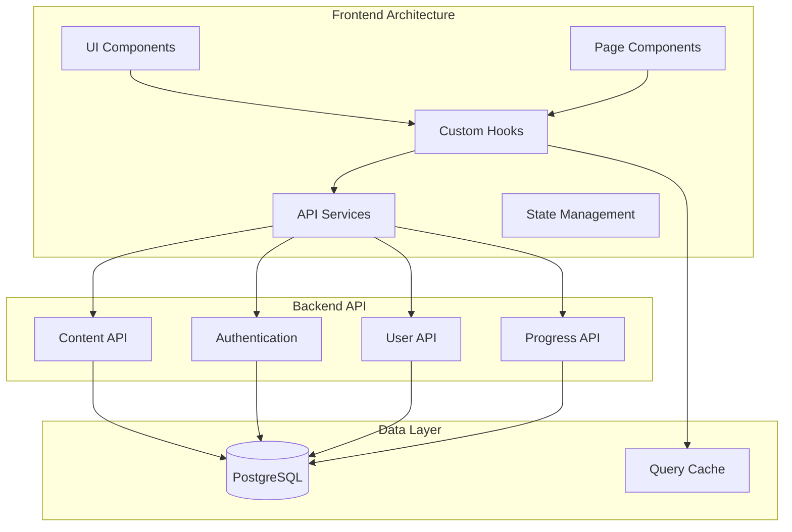

# Design Document

## Overview

This design transforms the WayrApp Creator CMS into a comprehensive, production-ready content management system with complete CRUD operations, DRY architecture, hierarchical content management, and advanced UI features. The system leverages the existing robust backend API structure and enhances the frontend with unified patterns, intelligent caching, and sophisticated user interactions.

The design follows a layered architecture with clear separation of concerns: API client layer for data operations, service layer for business logic, hook layer for state management, component layer for UI presentation, and page layer for route handling. All layers implement strict DRY principles with reusable patterns and components.

## Architecture

### System Architecture Overview



### DRY Architecture Principles

The design implements strict DRY principles through:

1. **Generic CRUD Hooks**: Unified hooks for all entity types (courses, levels, sections, modules, lessons, exercises)
2. **Reusable Form System**: Generic form components with type-specific validation
3. **Unified API Client**: Centralized HTTP client with consistent error handling
4. **Component Composition**: Reusable UI components with configurable behavior
5. **Shared Utilities**: Common functions for validation, formatting, and data manipulation

### Hierarchical Content Management

The system manages the complete content hierarchy:
- **Course** → **Level** → **Section** → **Module** → **Lesson** ↔ **Exercise** (many-to-many)

Each level provides:
- Full CRUD operations
- Drag-and-drop reordering
- Breadcrumb navigation
- Parent-child relationship validation

## Components and Interfaces

### Core API Client Architecture

```typescript
// Generic API client with unified patterns
interface ApiClient {
  // Generic CRUD operations
  create<T>(endpoint: string, data: Partial<T>): Promise<ApiResponse<T>>;
  read<T>(endpoint: string, params?: QueryParams): Promise<ApiResponse<T>>;
  update<T>(endpoint: string, id: string, data: Partial<T>): Promise<ApiResponse<T>>;
  delete(endpoint: string, id: string): Promise<ApiResponse<void>>;
  
  // List operations with pagination
  list<T>(endpoint: string, params?: ListParams): Promise<PaginatedResponse<T>>;
  
  // Specialized operations
  reorder(endpoint: string, ids: string[]): Promise<ApiResponse<void>>;
  assign(endpoint: string, data: AssignmentData): Promise<ApiResponse<void>>;
  unassign(endpoint: string, data: UnassignmentData): Promise<ApiResponse<void>>;
}

// Unified response types
interface ApiResponse<T> {
  success: boolean;
  data: T;
  message?: string;
}

interface PaginatedResponse<T> extends ApiResponse<T[]> {
  pagination: PaginationInfo;
}

interface PaginationInfo {
  page: number;
  limit: number;
  total: number;
  totalPages: number;
  hasNext: boolean;
  hasPrev: boolean;
}
```

### Generic CRUD Hook System

```typescript
// Generic hooks for all entity types
interface CrudHooks<T> {
  // Query hooks
  useList: (params?: ListParams) => UseQueryResult<PaginatedResponse<T>>;
  useGet: (id: string) => UseQueryResult<T>;
  
  // Mutation hooks
  useCreate: () => UseMutationResult<T, Error, Partial<T>>;
  useUpdate: () => UseMutationResult<T, Error, { id: string; data: Partial<T> }>;
  useDelete: () => UseMutationResult<void, Error, string>;
  
  // Specialized hooks
  useReorder?: () => UseMutationResult<void, Error, string[]>;
  useAssign?: () => UseMutationResult<void, Error, AssignmentData>;
  useUnassign?: () => UseMutationResult<void, Error, UnassignmentData>;
}

// Implementation for each entity type
const useCourses = (): CrudHooks<Course> => { /* ... */ };
const useLevels = (): CrudHooks<Level> => { /* ... */ };
const useSections = (): CrudHooks<Section> => { /* ... */ };
const useModules = (): CrudHooks<Module> => { /* ... */ };
const useLessons = (): CrudHooks<Lesson> => { /* ... */ };
const useExercises = (): CrudHooks<Exercise> => { /* ... */ };
```

### Hierarchical Navigation System

```typescript
interface HierarchicalNavigator {
  // Current location in hierarchy
  currentPath: HierarchyPath;
  
  // Navigation methods
  navigateToLevel: (courseId: string, levelId?: string) => void;
  navigateToSection: (levelId: string, sectionId?: string) => void;
  navigateToModule: (sectionId: string, moduleId?: string) => void;
  navigateToLesson: (moduleId: string, lessonId?: string) => void;
  
  // Breadcrumb generation
  generateBreadcrumbs: () => BreadcrumbItem[];
  
  // Validation
  validatePath: (path: HierarchyPath) => Promise<ValidationResult>;
}

interface BreadcrumbItem {
  label: string;
  path: string;
  isClickable: boolean;
  isLoading: boolean;
}

interface HierarchyPath {
  courseId?: string;
  levelId?: string;
  sectionId?: string;
  moduleId?: string;
  lessonId?: string;
}
```

### Exercise Management with Many-to-Many Relationships

```typescript
interface ExerciseManagement {
  // Global exercise bank
  exerciseBank: {
    list: (filters?: ExerciseFilters) => Promise<Exercise[]>;
    create: (exercise: CreateExerciseData) => Promise<Exercise>;
    update: (id: string, data: UpdateExerciseData) => Promise<Exercise>;
    delete: (id: string) => Promise<void>;
    getUsage: (id: string) => Promise<ExerciseUsage[]>;
  };
  
  // Lesson-exercise relationships
  lessonExercises: {
    list: (lessonId: string) => Promise<LessonExercise[]>;
    assign: (lessonId: string, exerciseId: string, order: number) => Promise<void>;
    unassign: (lessonId: string, exerciseId: string) => Promise<void>;
    reorder: (lessonId: string, exerciseIds: string[]) => Promise<void>;
  };
}

interface LessonExercise {
  exercise: Exercise;
  order: number;
  assignedAt: Date;
}

interface ExerciseUsage {
  lessonId: string;
  lessonName: string;
  moduleId: string;
  moduleName: string;
  order: number;
}
```

### Drag-and-Drop System

```typescript
interface DragDropSystem {
  // Drag-and-drop providers
  DragDropProvider: React.ComponentType<{ children: React.ReactNode }>;
  
  // Draggable components
  DraggableItem: React.ComponentType<DraggableItemProps>;
  DropZone: React.ComponentType<DropZoneProps>;
  
  // Hooks for drag-and-drop functionality
  useDragDrop: (config: DragDropConfig) => DragDropHandlers;
  
  // Reorder handlers
  handleReorder: (items: ReorderableItem[], newOrder: string[]) => Promise<void>;
}

interface DragDropConfig {
  entityType: 'level' | 'section' | 'module' | 'lesson' | 'exercise';
  parentId: string;
  onReorder: (newOrder: string[]) => Promise<void>;
  onError: (error: Error) => void;
}

interface DragDropHandlers {
  dragStart: (item: ReorderableItem) => void;
  dragEnd: (result: DropResult) => void;
  isDragging: boolean;
  draggedItem: ReorderableItem | null;
}
```

## Data Models

### Enhanced Type Definitions

```typescript
// Base entity interface
interface BaseEntity {
  id: string;
  createdAt: Date;
  updatedAt: Date;
}

// Hierarchical entity interface
interface HierarchicalEntity extends BaseEntity {
  name: string;
  order: number;
}

// Course entity (matches backend schema)
interface Course extends BaseEntity {
  id: string; // max 20 chars
  sourceLanguage: string; // max 20 chars
  targetLanguage: string; // max 20 chars
  name: string; // max 100 chars
  description?: string;
  isPublic: boolean;
  levels?: Level[];
}

// Level entity (matches backend schema)
interface Level extends HierarchicalEntity {
  id: string; // max 30 chars
  courseId: string;
  code: string; // max 10 chars
  sections?: Section[];
}

// Section entity (matches backend schema)
interface Section extends HierarchicalEntity {
  id: string; // max 40 chars
  levelId: string;
  modules?: Module[];
}

// Module entity (matches backend schema)
interface Module extends HierarchicalEntity {
  id: string; // max 50 chars
  sectionId: string;
  moduleType: 'informative' | 'basic_lesson' | 'reading' | 'dialogue' | 'exam';
  lessons?: Lesson[];
}

// Lesson entity (matches backend schema)
interface Lesson extends HierarchicalEntity {
  id: string; // max 60 chars
  moduleId: string;
  description?: string;
  experiencePoints: number;
  exercises?: LessonExercise[];
}

// Exercise entity (matches backend schema)
interface Exercise extends BaseEntity {
  id: string; // max 15 chars
  exerciseType: 'translation' | 'fill-in-the-blank' | 'vof' | 'pairs' | 'informative' | 'ordering';
  data: ExerciseData; // JSON data specific to exercise type
  lessons?: LessonExercise[];
}

// Exercise data types for each exercise type
interface TranslationExerciseData {
  sourceText: string;
  targetText: string;
  hints?: string[];
}

interface FillInTheBlankExerciseData {
  text: string;
  blanks: BlankItem[];
}

interface VofExerciseData {
  statement: string;
  isTrue: boolean;
  explanation?: string;
}

interface PairsExerciseData {
  pairs: PairItem[];
}

interface InformativeExerciseData {
  title: string;
  content: string;
  media?: MediaItem[];
}

interface OrderingExerciseData {
  items: OrderableItem[];
  correctOrder: number[];
}
```

### Form Data Models

```typescript
// Generic form interfaces
interface FormConfig<T> {
  initialValues: Partial<T>;
  validationSchema: ZodSchema<T>;
  onSubmit: (values: T) => Promise<void>;
  onCancel?: () => void;
}

interface FormField {
  name: string;
  label: string;
  type: 'text' | 'textarea' | 'select' | 'number' | 'boolean' | 'custom';
  required?: boolean;
  placeholder?: string;
  options?: SelectOption[];
  validation?: FieldValidation;
  component?: React.ComponentType<any>;
}

interface DynamicFormConfig {
  entityType: string;
  fields: FormField[];
  layout: FormLayout;
  actions: FormAction[];
}
```

## Error Handling

### Comprehensive Error Management System

```typescript
interface ErrorHandlingSystem {
  // Error types
  errorTypes: {
    NetworkError: 'NETWORK_ERROR';
    ValidationError: 'VALIDATION_ERROR';
    AuthenticationError: 'AUTHENTICATION_ERROR';
    AuthorizationError: 'AUTHORIZATION_ERROR';
    NotFoundError: 'NOT_FOUND_ERROR';
    ConflictError: 'CONFLICT_ERROR';
    ServerError: 'SERVER_ERROR';
  };
  
  // Error handlers
  handleApiError: (error: ApiError) => ErrorResponse;
  handleNetworkError: (error: NetworkError) => ErrorResponse;
  handleValidationError: (error: ValidationError) => ErrorResponse;
  
  // Recovery mechanisms
  retryOperation: (operation: () => Promise<any>, maxRetries: number) => Promise<any>;
  fallbackToCache: (key: string) => any;
  redirectToLogin: () => void;
  
  // User feedback
  showErrorToast: (message: string, options?: ToastOptions) => void;
  showErrorModal: (error: ErrorDetails) => void;
  showInlineError: (fieldName: string, message: string) => void;
}

interface ErrorResponse {
  type: string;
  message: string;
  details?: any;
  recoverable: boolean;
  retryable: boolean;
  actions: ErrorAction[];
}

interface ErrorAction {
  label: string;
  action: () => void;
  primary?: boolean;
}
```

### Validation System

```typescript
interface ValidationSystem {
  // Schema definitions
  schemas: {
    course: ZodSchema<Course>;
    level: ZodSchema<Level>;
    section: ZodSchema<Section>;
    module: ZodSchema<Module>;
    lesson: ZodSchema<Lesson>;
    exercise: ZodSchema<Exercise>;
  };
  
  // Dynamic validation
  validateEntity: <T>(entityType: string, data: T) => ValidationResult;
  validateHierarchy: (path: HierarchyPath) => Promise<ValidationResult>;
  validateExerciseData: (type: ExerciseType, data: any) => ValidationResult;
  
  // Real-time validation
  useFieldValidation: (fieldName: string, schema: ZodSchema) => FieldValidationHook;
  useFormValidation: <T>(schema: ZodSchema<T>) => FormValidationHook<T>;
}

interface ValidationResult {
  isValid: boolean;
  errors: ValidationError[];
  warnings: ValidationWarning[];
}

interface ValidationError {
  field: string;
  message: string;
  code: string;
}
```

## Testing Strategy

### Comprehensive Testing Approach

```typescript
interface TestingStrategy {
  // Unit testing
  unitTests: {
    components: ComponentTestSuite;
    hooks: HookTestSuite;
    services: ServiceTestSuite;
    utils: UtilityTestSuite;
  };
  
  // Integration testing
  integrationTests: {
    apiIntegration: ApiIntegrationTestSuite;
    userFlows: UserFlowTestSuite;
    errorHandling: ErrorHandlingTestSuite;
  };
  
  // End-to-end testing
  e2eTests: {
    criticalPaths: CriticalPathTestSuite;
    crossBrowser: CrossBrowserTestSuite;
    accessibility: AccessibilityTestSuite;
  };
  
  // Performance testing
  performanceTests: {
    loadTesting: LoadTestSuite;
    memoryLeaks: MemoryLeakTestSuite;
    bundleSize: BundleSizeTestSuite;
  };
}

// Test utilities
interface TestUtilities {
  mockApiClient: MockApiClient;
  testDataFactory: TestDataFactory;
  renderWithProviders: (component: React.ReactElement) => RenderResult;
  setupTestEnvironment: () => TestEnvironment;
}
```

### Test Data Management

```typescript
interface TestDataFactory {
  // Entity factories
  createCourse: (overrides?: Partial<Course>) => Course;
  createLevel: (overrides?: Partial<Level>) => Level;
  createSection: (overrides?: Partial<Section>) => Section;
  createModule: (overrides?: Partial<Module>) => Module;
  createLesson: (overrides?: Partial<Lesson>) => Lesson;
  createExercise: (type: ExerciseType, overrides?: Partial<Exercise>) => Exercise;
  
  // Hierarchy factories
  createCourseHierarchy: (config: HierarchyConfig) => CourseHierarchy;
  createLessonWithExercises: (config: LessonConfig) => LessonWithExercises;
  
  // Mock data generators
  generateMockApiResponses: (entityType: string) => MockApiResponse[];
  generateErrorScenarios: () => ErrorScenario[];
}
```

## Implementation Architecture

### Component Layer Architecture

```typescript
// Generic list component for all entity types
interface GenericListComponent<T> {
  data: T[];
  loading: boolean;
  error: Error | null;
  onEdit: (item: T) => void;
  onDelete: (item: T) => void;
  onReorder?: (newOrder: string[]) => void;
  renderItem: (item: T) => React.ReactNode;
  emptyState: React.ReactNode;
  actions?: ListAction[];
}

// Generic form component for all entity types
interface GenericFormComponent<T> {
  initialValues: Partial<T>;
  validationSchema: ZodSchema<T>;
  onSubmit: (values: T) => Promise<void>;
  onCancel: () => void;
  fields: FormField[];
  loading: boolean;
  error: Error | null;
}

// Hierarchical navigator component
interface HierarchicalNavigatorComponent {
  currentPath: HierarchyPath;
  onNavigate: (path: HierarchyPath) => void;
  breadcrumbs: BreadcrumbItem[];
  showCreateButton: boolean;
  onCreateClick: () => void;
}
```

### Service Layer Architecture

```typescript
// Generic service interface
interface GenericService<T> {
  list: (params?: ListParams) => Promise<PaginatedResponse<T>>;
  get: (id: string) => Promise<T>;
  create: (data: Partial<T>) => Promise<T>;
  update: (id: string, data: Partial<T>) => Promise<T>;
  delete: (id: string) => Promise<void>;
}

// Hierarchical service interface
interface HierarchicalService<T> extends GenericService<T> {
  listByParent: (parentId: string, params?: ListParams) => Promise<PaginatedResponse<T>>;
  reorder: (parentId: string, ids: string[]) => Promise<void>;
}

// Exercise service with many-to-many support
interface ExerciseService extends GenericService<Exercise> {
  getByType: (type: ExerciseType) => Promise<Exercise[]>;
  getUsage: (id: string) => Promise<ExerciseUsage[]>;
  assignToLesson: (lessonId: string, exerciseId: string, order: number) => Promise<void>;
  unassignFromLesson: (lessonId: string, exerciseId: string) => Promise<void>;
  reorderInLesson: (lessonId: string, exerciseIds: string[]) => Promise<void>;
}
```

### State Management Architecture

```typescript
// Query key factory for consistent caching
interface QueryKeyFactory {
  courses: {
    all: () => string[];
    list: (params?: ListParams) => string[];
    detail: (id: string) => string[];
  };
  levels: {
    all: () => string[];
    byCourse: (courseId: string) => string[];
    detail: (id: string) => string[];
  };
  // ... similar patterns for all entity types
}

// Cache invalidation strategies
interface CacheInvalidationStrategy {
  onCourseUpdate: (courseId: string) => void;
  onLevelUpdate: (levelId: string, courseId: string) => void;
  onSectionUpdate: (sectionId: string, levelId: string) => void;
  onModuleUpdate: (moduleId: string, sectionId: string) => void;
  onLessonUpdate: (lessonId: string, moduleId: string) => void;
  onExerciseUpdate: (exerciseId: string) => void;
  onExerciseAssignment: (lessonId: string, exerciseId: string) => void;
}
```

This comprehensive design provides a solid foundation for implementing the CMS improvements with strict DRY principles, robust error handling, and scalable architecture patterns.