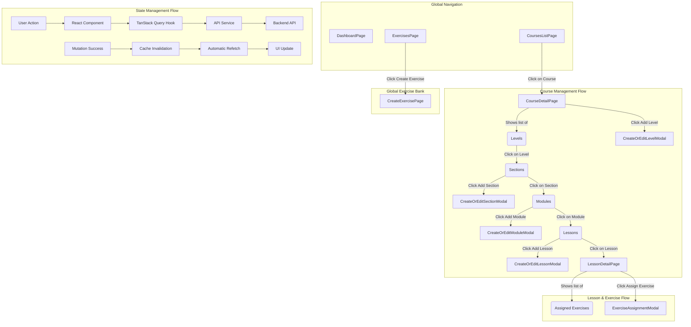

# Design Document

## Overview

The End-to-End Course Management feature provides a comprehensive interface for content creators to manage the complete hierarchical structure of educational courses within the WayrApp Creator CMS. The system follows a strict data hierarchy: Course → Level → Section → Module → Lesson, with a global Exercise bank that can be assigned to Lessons through a many-to-many relationship.

The design leverages React with TypeScript, TanStack Query for server state management, React Hook Form with Zod validation, and the existing design system components. The architecture ensures type safety, efficient caching, and consistent user experience patterns throughout the application.

## Architecture

### Component Hierarchy

```
App
├── CoursesListPage
│   ├── ContentList<Course>
│   └── CourseCard (multiple)
├── CreateCoursePage
│   └── CourseForm
├── CourseDetailPage (Central Hub)
│   ├── CourseHeader
│   ├── HierarchicalNavigator
│   │   ├── LevelsSection
│   │   │   ├── LevelCard (multiple)
│   │   │   └── CreateOrEditLevelModal
│   │   ├── SectionsSection (when level selected)
│   │   │   ├── SectionCard (multiple)
│   │   │   └── CreateOrEditSectionModal
│   │   ├── ModulesSection (when section selected)
│   │   │   ├── ModuleCard (multiple)
│   │   │   └── CreateOrEditModuleModal
│   │   └── LessonsSection (when module selected)
│   │       ├── LessonCard (multiple)
│   │       └── CreateOrEditLessonModal
│   └── BreadcrumbNavigation
├── LessonDetailPage (Separate for Exercise Management)
│   ├── LessonHeader
│   ├── AssignedExercisesList
│   └── ExerciseAssignmentModal
├── ExercisesPage (Global Exercise Bank)
│   ├── ContentList<Exercise>
│   └── ExerciseCard (multiple)
└── CreateExercisePage
    └── DynamicExerciseForm
```

### Data Flow Architecture



### Route Structure

```
/courses                    - CoursesListPage
/courses/new               - CreateCoursePage
/courses/:courseId         - CourseDetailPage (Central Hub with hierarchical navigation)
/lessons/:lessonId         - LessonDetailPage (Exercise management)
/exercises                 - ExercisesPage (Global exercise bank)
/exercises/new            - CreateExercisePage
```

## Components and Interfaces

### Core Page Components

#### CoursesListPage
```typescript
interface CoursesListPageProps {}

/**
 * Main courses listing page with search, pagination, and bulk actions
 * Uses ContentList<Course> with CourseCard rendering
 * Integrates with useCoursesQuery for data fetching
 */
```

#### CreateCoursePage
```typescript
interface CreateCoursePageProps {}

/**
 * Course creation form page
 * Uses CourseForm component with validation
 * Handles form submission and navigation
 */
```

#### CourseDetailPage (Central Hub)
```typescript
interface CourseDetailPageProps {
  courseId: string;
}

/**
 * Central hub for managing the entire course hierarchy
 * Features:
 * - Course header with metadata and edit options
 * - Hierarchical navigator with contextual sections
 * - Breadcrumb navigation for current selection
 * - Modal-based CRUD operations for all entities
 * - State management for current selection (level/section/module)
 */
```

#### LessonDetailPage
```typescript
interface LessonDetailPageProps {
  lessonId: string;
}

/**
 * Dedicated page for lesson exercise management
 * Features:
 * - Lesson metadata and edit options
 * - Assigned exercises list with drag-and-drop reordering
 * - Exercise assignment modal for selecting from global bank
 * - Exercise unassignment functionality
 */
```

### Form Components

#### CourseForm
```typescript
interface CourseFormProps {
  initialData?: Partial<Course>;
  onSubmit: (data: CourseFormData) => void;
  isLoading?: boolean;
  error?: string | null;
}

/**
 * Reusable form component for course creation/editing
 * Implements React Hook Form with Zod validation
 * Includes fields: name, sourceLanguage, targetLanguage, description, isPublic
 */
```

#### Modal-Based Forms
```typescript
interface CreateOrEditLevelModalProps {
  isOpen: boolean;
  onClose: () => void;
  courseId: string;
  initialData?: Partial<Level>;
  onSuccess: () => void;
}

interface CreateOrEditSectionModalProps {
  isOpen: boolean;
  onClose: () => void;
  levelId: string;
  initialData?: Partial<Section>;
  onSuccess: () => void;
}

interface CreateOrEditModuleModalProps {
  isOpen: boolean;
  onClose: () => void;
  sectionId: string;
  initialData?: Partial<Module>;
  onSuccess: () => void;
}

interface CreateOrEditLessonModalProps {
  isOpen: boolean;
  onClose: () => void;
  moduleId: string;
  initialData?: Partial<Lesson>;
  onSuccess: () => void;
}

/**
 * Modal-based forms for hierarchical entity CRUD operations
 * Each modal contains the appropriate form with validation
 * Handles submission and cache invalidation
 * Provides consistent UX across all entity types
 */
```

#### DynamicExerciseForm
```typescript
interface DynamicExerciseFormProps {
  onSubmit: (data: ExerciseFormData) => void;
  isLoading?: boolean;
  error?: string | null;
}

/**
 * Dynamic form that changes based on selected exercise type
 * Renders different field sets for each exercise type
 * Handles complex validation for exercise-specific data
 */
```

### Hierarchical Navigation Components

#### HierarchicalNavigator
```typescript
interface HierarchicalNavigatorProps {
  courseId: string;
  selectedLevel?: string;
  selectedSection?: string;
  selectedModule?: string;
  onLevelSelect: (levelId: string) => void;
  onSectionSelect: (sectionId: string) => void;
  onModuleSelect: (moduleId: string) => void;
}

/**
 * Main navigation component that manages hierarchical state
 * Renders appropriate sections based on current selection
 * Handles breadcrumb navigation and context switching
 */
```

#### Contextual Section Components
```typescript
interface LevelsSectionProps {
  courseId: string;
  selectedLevel?: string;
  onLevelSelect: (levelId: string) => void;
}

interface SectionsSectionProps {
  levelId: string;
  selectedSection?: string;
  onSectionSelect: (sectionId: string) => void;
}

interface ModulesSectionProps {
  sectionId: string;
  selectedModule?: string;
  onModuleSelect: (moduleId: string) => void;
}

interface LessonsSectionProps {
  moduleId: string;
  onLessonClick: (lessonId: string) => void;
}

/**
 * Contextual sections that show relevant entities
 * Each section includes list view and CRUD actions
 * Integrated with modal forms for seamless UX
 */
```

#### Card Components
```typescript
interface LevelCardProps {
  level: Level;
  isSelected?: boolean;
  onSelect: (level: Level) => void;
  onEdit: (level: Level) => void;
  onDelete: (level: Level) => void;
}

// Similar interfaces for SectionCard, ModuleCard, LessonCard

/**
 * Consistent card components for hierarchical entities
 * Adapted for each entity type with relevant metadata
 * Integrated with modal-based editing actions
 */
```

### Specialized Components

#### ExerciseAssignmentModal
```typescript
interface ExerciseAssignmentModalProps {
  lessonId: string;
  isOpen: boolean;
  onClose: () => void;
  onAssign: (exerciseIds: string[]) => void;
}

/**
 * Modal for selecting exercises from global bank
 * Includes search and filtering capabilities
 * Supports multi-select with order specification
 */
```

#### AssignedExercisesList
```typescript
interface AssignedExercisesListProps {
  lessonId: string;
  exercises: LessonExercise[];
  onReorder: (exerciseIds: string[]) => void;
  onUnassign: (exerciseId: string) => void;
}

/**
 * Drag-and-drop list for managing lesson exercises
 * Shows exercise details and order controls
 * Handles reordering and unassignment actions
 */
```

## Data Models

### Extended Type Definitions

```typescript
// Hierarchical relationship types
interface CourseWithLevels extends Course {
  levels?: Level[];
  levelsCount?: number;
}

interface LevelWithSections extends Level {
  sections?: Section[];
  sectionsCount?: number;
}

interface SectionWithModules extends Section {
  modules?: Module[];
  modulesCount?: number;
}

interface ModuleWithLessons extends Module {
  lessons?: Lesson[];
  lessonsCount?: number;
}

interface LessonWithExercises extends Lesson {
  exercises?: LessonExercise[];
  exercisesCount?: number;
}

// Form data types
interface LevelFormData {
  code: string;
  name: string;
  order: number;
}

interface SectionFormData {
  name: string;
  order: number;
}

interface ModuleFormData {
  moduleType: ModuleType;
  name: string;
  order: number;
}

interface LessonFormData {
  experiencePoints: number;
  order: number;
}

// Exercise-specific data structures
interface TranslationExerciseData {
  sourceText: string;
  targetText: string;
  hints?: string[];
}

interface FillInTheBlankExerciseData {
  text: string;
  blanks: Array<{
    position: number;
    correctAnswers: string[];    // Array of valid answers for flexibility
    hints?: string[];
  }>;
}

interface VOFExerciseData {
  statement: string;
  isTrue: boolean;
  explanation?: string;
}

interface PairsExerciseData {
  pairs: Array<{
    left: string;
    right: string;
  }>;
}

interface OrderingExerciseData {
  // Array of items to be ordered. The correct sequence is determined by the array order in the database.
  items: Array<{
    id: string; // A unique client-side identifier (e.g., generated with a UUID library)
    text: string;
  }>;
}

interface InformativeExerciseData {
  title: string;
  content: string;
  media?: {
    type: 'image' | 'video' | 'audio';
    url: string;
    alt?: string;
  };
}
```

## Error Handling

### Error Boundary Strategy

```typescript
/**
 * Hierarchical error boundaries for different levels of the application
 * - Global error boundary for unhandled errors
 * - Page-level boundaries for route-specific errors
 * - Component-level boundaries for complex components
 */

interface ErrorBoundaryState {
  hasError: boolean;
  error?: Error;
  errorInfo?: ErrorInfo;
}

/**
 * Error recovery strategies:
 * - Retry mechanisms for network failures
 * - Fallback UI for component failures
 * - User-friendly error messages with actionable steps
 */
```

### API Error Handling

```typescript
/**
 * Standardized error handling across all API services
 * - Network error detection and retry logic
 * - HTTP status code specific error messages
 * - Validation error parsing and display
 * - Authentication error handling with token refresh
 */

interface ApiErrorPayload {
  code: string;
  message: string;
  details?: any; // For Zod validation errors, etc.
  timestamp: string;
  path: string;
}

interface FullApiErrorResponse {
  success: false;
  timestamp: string;
  error: ApiErrorPayload;
}
```

## Testing Strategy

### Unit Testing

```typescript
/**
 * Component Testing:
 * - Form validation logic
 * - Event handlers and user interactions
 * - Conditional rendering based on props/state
 * - Error state handling
 */

/**
 * Hook Testing:
 * - TanStack Query hook behavior
 * - Cache invalidation logic
 * - Error handling in hooks
 * - Loading state management
 */

/**
 * Service Testing:
 * - API request/response handling
 * - Data transformation logic
 * - Error parsing and handling
 * - Authentication integration
 */
```

### Integration Testing

```typescript
/**
 * User Flow Testing:
 * - Complete course creation workflow
 * - Hierarchical navigation patterns
 * - Exercise assignment and management
 * - Search and pagination functionality
 */

/**
 * API Integration Testing:
 * - End-to-end API communication
 * - Cache invalidation after mutations
 * - Error recovery scenarios
 * - Authentication flow integration
 */
```

### E2E Testing Considerations

```typescript
/**
 * Critical User Journeys:
 * - Course creation and management
 * - Hierarchical content navigation
 * - Exercise bank management
 * - Lesson exercise assignment
 */
```

## State Management for Hierarchical Navigation

### CourseDetailPage State Management

```typescript
interface CourseDetailState {
  selectedLevel?: string;
  selectedSection?: string;
  selectedModule?: string;
  
  // Modal states
  levelModalOpen: boolean;
  sectionModalOpen: boolean;
  moduleModalOpen: boolean;
  lessonModalOpen: boolean;
  
  // Edit states
  editingLevel?: Level;
  editingSection?: Section;
  editingModule?: Module;
  editingLesson?: Lesson;
}

/**
 * State management strategy:
 * - Use React state for UI navigation state
 * - URL params for deep linking to specific selections
 * - TanStack Query for server state
 * - Modal state management for CRUD operations
 */
```

### URL State Synchronization

```typescript
/**
 * URL structure for deep linking:
 * /courses/:courseId?level=:levelId&section=:sectionId&module=:moduleId
 * 
 * Benefits:
 * - Bookmarkable URLs for specific course contexts
 * - Browser back/forward navigation support
 * - Shareable links to specific course sections
 */
```

### Context Provider Pattern

```typescript
interface CourseHierarchyContextValue {
  courseId: string;
  selectedLevel?: string;
  selectedSection?: string;
  selectedModule?: string;
  
  selectLevel: (levelId: string) => void;
  selectSection: (sectionId: string) => void;
  selectModule: (moduleId: string) => void;
  
  openLevelModal: (level?: Level) => void;
  openSectionModal: (section?: Section) => void;
  openModuleModal: (module?: Module) => void;
  openLessonModal: (lesson?: Lesson) => void;
  
  closeModals: () => void;
}

/**
 * Context provider for sharing hierarchical state
 * Reduces prop drilling across nested components
 * Centralizes navigation and modal management logic
 */
```

## TanStack Query Implementation

### Query Key Factory

```typescript
export const queryKeys = {
  // Courses
  courses: {
    all: ['courses'] as const,
    lists: () => [...queryKeys.courses.all, 'list'] as const,
    list: (params?: PaginationParams) => [...queryKeys.courses.lists(), params] as const,
    details: () => [...queryKeys.courses.all, 'detail'] as const,
    detail: (id: string) => [...queryKeys.courses.details(), id] as const,
  },
  
  // Levels
  levels: {
    all: ['levels'] as const,
    lists: () => [...queryKeys.levels.all, 'list'] as const,
    list: (courseId: string, params?: PaginationParams) => 
      [...queryKeys.levels.lists(), courseId, params] as const,
    details: () => [...queryKeys.levels.all, 'detail'] as const,
    detail: (id: string) => [...queryKeys.levels.details(), id] as const,
  },
  
  // Sections
  sections: {
    all: ['sections'] as const,
    lists: () => [...queryKeys.sections.all, 'list'] as const,
    list: (levelId: string, params?: PaginationParams) => 
      [...queryKeys.sections.lists(), levelId, params] as const,
    details: () => [...queryKeys.sections.all, 'detail'] as const,
    detail: (id: string) => [...queryKeys.sections.details(), id] as const,
  },
  
  // Modules
  modules: {
    all: ['modules'] as const,
    lists: () => [...queryKeys.modules.all, 'list'] as const,
    list: (sectionId: string, params?: PaginationParams) => 
      [...queryKeys.modules.lists(), sectionId, params] as const,
    details: () => [...queryKeys.modules.all, 'detail'] as const,
    detail: (id: string) => [...queryKeys.modules.details(), id] as const,
  },
  
  // Lessons
  lessons: {
    all: ['lessons'] as const,
    lists: () => [...queryKeys.lessons.all, 'list'] as const,
    list: (moduleId: string, params?: PaginationParams) => 
      [...queryKeys.lessons.lists(), moduleId, params] as const,
    details: () => [...queryKeys.lessons.all, 'detail'] as const,
    detail: (id: string) => [...queryKeys.lessons.details(), id] as const,
    exercises: (id: string) => [...queryKeys.lessons.detail(id), 'exercises'] as const,
  },
  
  // Exercises
  exercises: {
    all: ['exercises'] as const,
    lists: () => [...queryKeys.exercises.all, 'list'] as const,
    list: (params?: PaginationParams) => [...queryKeys.exercises.lists(), params] as const,
    details: () => [...queryKeys.exercises.all, 'detail'] as const,
    detail: (id: string) => [...queryKeys.exercises.details(), id] as const,
  },
};
```

### Cache Invalidation Strategy

```typescript
/**
 * Hierarchical cache invalidation patterns:
 * 
 * When a Course is created/updated/deleted:
 * - Invalidate courses.lists()
 * 
 * When a Level is created/updated/deleted:
 * - Invalidate levels.lists(courseId)
 * - Invalidate courses.detail(courseId) if it includes level count
 * 
 * When a Section is created/updated/deleted:
 * - Invalidate sections.lists(levelId)
 * - Invalidate levels.detail(levelId) if it includes section count
 * 
 * When a Module is created/updated/deleted:
 * - Invalidate modules.lists(sectionId)
 * - Invalidate sections.detail(sectionId) if it includes module count
 * 
 * When a Lesson is created/updated/deleted:
 * - Invalidate lessons.lists(moduleId)
 * - Invalidate modules.detail(moduleId) if it includes lesson count
 * 
 * When Exercise assignments change:
 * - Invalidate lessons.exercises(lessonId)
 * - Invalidate lessons.detail(lessonId) if it includes exercise count
 */
```

### Optimistic Updates

```typescript
/**
 * Optimistic update patterns for better UX:
 * 
 * - Course creation: Add to list immediately, rollback on error
 * - Exercise assignment: Update lesson exercises immediately
 * - Reordering: Update order immediately, rollback on error
 * - Status changes: Update isPublic immediately
 */
```

## Performance Considerations

### Code Splitting

```typescript
/**
 * Lazy loading strategy:
 * - Each major page component is lazy loaded
 * - Form components are loaded on demand
 * - Modal components are loaded when opened
 */
```

### Caching Strategy

```typescript
/**
 * TanStack Query caching configuration:
 * - List queries: 5 minute stale time
 * - Detail queries: 10 minute stale time
 * - Exercise bank: 15 minute stale time (less frequently changed)
 * - Background refetch on window focus for critical data
 */
```

### Bundle Optimization

```typescript
/**
 * Import optimization:
 * - Tree-shaking for utility libraries
 * - Selective imports from UI component library
 * - Dynamic imports for heavy dependencies
 */
```