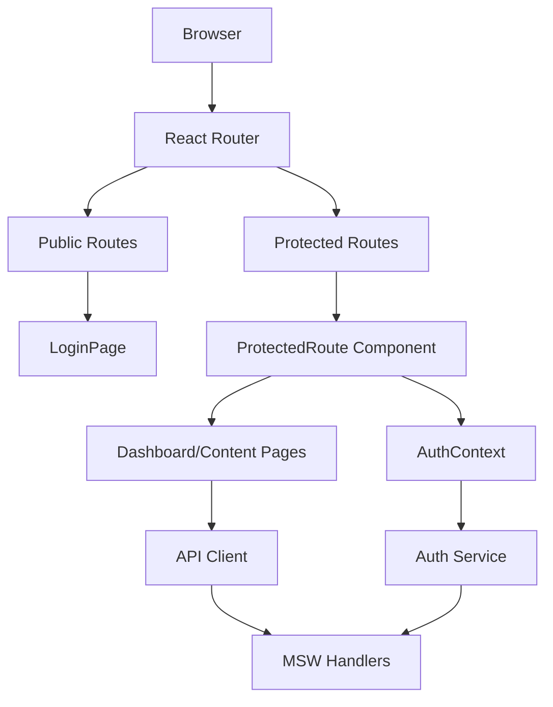
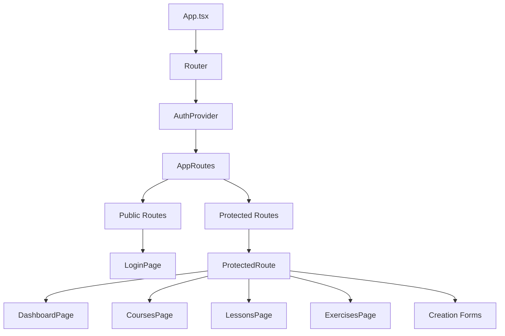
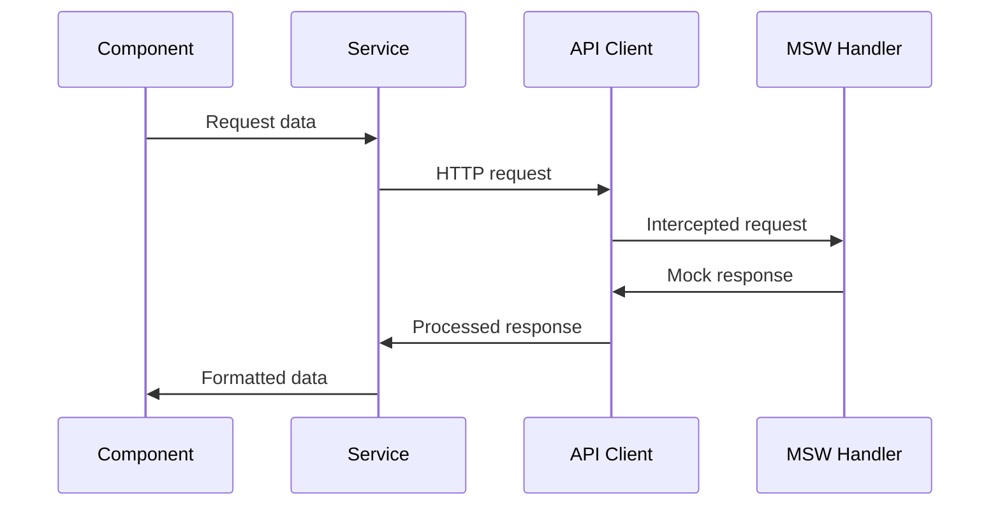

# Design Document

## Overview

This design document outlines the technical implementation plan for integrating the existing frontend-creator application components into a cohesive, runnable local development environment. The solution leverages the existing React application structure, MSW mock handlers, and authentication system to create a stable MVP that operates entirely against mock data.

The architecture focuses on wiring together pre-existing components rather than building new functionality, ensuring rapid deployment of a working local development environment for the Creator Tool.

## Architecture

### High-Level Architecture



### Component Hierarchy



## Components and Interfaces

### Routing Architecture

**Router Configuration**
- **Base Router**: BrowserRouter with `/creator` basename (already configured)
- **Public Routes**: `/login` accessible without authentication
- **Protected Routes**: All other routes wrapped in ProtectedRoute component
- **Route Structure**:
  - `/` → Redirect to `/dashboard`
  - `/login` → LoginPage component
  - `/dashboard` → DashboardPage component
  - `/courses` → CoursesPage component
  - `/courses/new` → Course creation form
  - `/lessons` → LessonsPage component  
  - `/lessons/create` → Lesson creation form
  - `/exercises` → ExercisesPage component
  - `/exercises/create` → Exercise creation form
  - `/lessons/:lessonId/exercises` → Exercise assignment page
  - `/profile` → ProfilePage component

**ProtectedRoute Component**
- Utilizes existing AuthContext for authentication state
- Displays loading spinner during authentication check
- Redirects to `/login` if user is not authenticated
- Preserves intended destination in location state for post-login redirect

### State & Authentication Integration

**AuthContext Integration**
- **Current Implementation**: Fully functional with login/logout methods
- **Session Management**: Token-based authentication with localStorage persistence
- **Token Refresh**: Automatic token refresh handling in API client
- **User State**: Maintains current user data and authentication status

**Authentication Flow**
1. User accesses protected route
2. ProtectedRoute checks authentication via AuthContext
3. If not authenticated, redirect to `/login` with return URL
4. LoginPage submits credentials via AuthContext.login()
5. AuthService processes login through API client (intercepted by MSW)
6. On success, user redirected to intended destination or `/dashboard`

**State Management Strategy**
- **Authentication State**: Managed by AuthContext (existing)
- **Component State**: Local state using React hooks for UI interactions
- **Data Fetching State**: Loading/error states managed per component
- **No Global State Management**: Keeping architecture simple for MVP

### Data Fetching with MSW

**API Client Configuration**
- **Base URL**: Configurable via environment variables
- **Request Interceptors**: Automatic token attachment for authenticated requests
- **Response Interceptors**: Error handling and token refresh logic
- **Error Handling**: Structured error responses with user-friendly messages

**MSW Handler Integration**
- **Authentication Endpoints**: Login, logout, token refresh
- **Course Management**: CRUD operations with pagination and search
- **Lesson Management**: Module-based lesson creation and retrieval
- **Exercise Management**: Exercise creation and lesson assignment
- **Error Simulation**: Dedicated endpoints for testing error scenarios

**Data Flow Architecture**


**Loading and Error States**
- **Loading States**: Consistent loading spinners across all data-fetching components
- **Error Boundaries**: Graceful error handling without application crashes
- **Retry Mechanisms**: User-initiated retry for failed requests
- **Fallback Content**: Meaningful fallback content when data is unavailable

### Page Component Integration

**DashboardPage**
- **Data Sources**: User statistics and course list via MSW handlers
- **Loading States**: Skeleton loaders for statistics and course cards
- **Error Handling**: Graceful degradation with retry options
- **Navigation**: Links to content management areas

**Content List Pages (Courses, Lessons, Exercises)**
- **Data Fetching**: Paginated lists with search functionality
- **Create New Buttons**: Navigation to respective creation forms
- **Filtering/Search**: Client-side filtering of mock data
- **Empty States**: Meaningful empty states with call-to-action

**Creation Form Pages**
- **Form Validation**: Client-side validation using existing form libraries
- **Submission Handling**: Form submission without full backend integration
- **Navigation**: Return to list pages after form interaction
- **Draft Saving**: Local storage for form draft persistence (optional)

## Data Models

### Authentication Models
```typescript
interface User {
  id: string;
  email: string;
  name: string;
  role: string;
  createdAt: string;
  updatedAt: string;
}

interface AuthResponse {
  token: string;
  refreshToken: string;
  user: User;
}

interface LoginCredentials {
  email: string;
  password: string;
  rememberMe?: boolean;
}
```

### Content Models
```typescript
interface Course {
  id: string;
  name: string;
  description: string;
  status: 'draft' | 'published' | 'archived';
  createdAt: string;
  updatedAt: string;
}

interface Lesson {
  id: string;
  title: string;
  content: string;
  moduleId: string;
  order: number;
  createdAt: string;
  updatedAt: string;
}

interface Exercise {
  id: string;
  title: string;
  type: 'multiple-choice' | 'fill-blank' | 'matching';
  content: any;
  createdAt: string;
  updatedAt: string;
}
```

## Error Handling

### Error Handling Strategy

**API Error Handling**
- **Network Errors**: Display user-friendly messages with retry options
- **Authentication Errors**: Automatic logout and redirect to login
- **Validation Errors**: Form-level error display with field highlighting
- **Server Errors**: Generic error messages with support contact information

**Component Error Boundaries**
- **Page-Level Boundaries**: Prevent entire application crashes
- **Component-Level Boundaries**: Isolate errors to specific UI sections
- **Error Reporting**: Console logging for development debugging
- **Fallback UI**: Meaningful fallback components for error states

**MSW Error Simulation**
- **Dedicated Error Endpoints**: Test various error scenarios
- **Network Failure Simulation**: Test offline/network error handling
- **Rate Limiting Simulation**: Test rate limit error responses
- **Validation Error Simulation**: Test form validation error flows

### Error Recovery Mechanisms

**Automatic Recovery**
- **Token Refresh**: Automatic token refresh on 401 errors
- **Request Retry**: Automatic retry for transient network errors
- **State Reset**: Clear corrupted state on critical errors

**User-Initiated Recovery**
- **Retry Buttons**: Manual retry for failed operations
- **Refresh Actions**: Page-level refresh options
- **Logout/Login**: Authentication reset for auth-related errors

## Testing Strategy

### MSW Integration Testing
- **Handler Coverage**: Ensure all API endpoints have corresponding MSW handlers
- **Response Validation**: Verify mock responses match expected data structures
- **Error Scenario Testing**: Test error handling with MSW error simulation
- **Authentication Flow Testing**: End-to-end authentication flow validation

### Component Integration Testing
- **Route Testing**: Verify routing behavior and protected route access
- **Authentication Testing**: Test login/logout flows with mock responses
- **Data Fetching Testing**: Verify component behavior with MSW responses
- **Error State Testing**: Test component error handling and recovery

### Development Testing Approach
- **Manual Testing**: Browser-based testing against MSW handlers
- **Console Monitoring**: Monitor network requests and MSW interceptions
- **State Inspection**: React DevTools for state and context inspection
- **Error Simulation**: Test error scenarios using MSW error endpoints

## Developer Experience (DX)

### Development Scripts

**Root Package.json Updates**
```json
{
  "scripts": {
    "dev:creator": "npm run dev --workspace=wayrapp-creator"
  }
}
```

**Environment Configuration**
- **Frontend-Creator .env.example**:
```env
VITE_API_URL=http://localhost:3000
VITE_APP_NAME=WayrApp Creator Tool
VITE_ENABLE_MSW=true
```

### MSW Development Setup

**Browser MSW Integration**
- **Service Worker Registration**: Automatic MSW service worker setup for development
- **Handler Hot Reloading**: MSW handlers update without full page refresh
- **Request Logging**: Console logging of intercepted requests for debugging
- **Handler Status**: Visual indicator of MSW status in development

**Development Workflow**
1. Install dependencies: `npm install`
2. Start development server: `npm run dev:creator`
3. Access application at configured local URL
4. MSW automatically intercepts API calls
5. All functionality works against mock data

### Documentation Updates

**README.md Section: "Running the Creator Tool Locally"**
```markdown
## Running the Creator Tool Locally

The Creator Tool is a web application for content creators to manage courses, lessons, and exercises.

### Prerequisites
- Node.js 18+ installed
- npm or yarn package manager

### Setup
1. Install dependencies:
   ```bash
   npm install
   ```

2. Start the development server:
   ```bash
   npm run dev:creator
   ```

3. Open your browser and navigate to the displayed local URL (typically http://localhost:5173/creator)

### Development Features
- **Mock Data**: All API calls are intercepted by Mock Service Worker (MSW)
- **Hot Reload**: Changes to code automatically refresh the browser
- **Authentication**: Use test@example.com / password123 for login
- **Error Testing**: Access /error endpoints to test error handling

### Available Test Credentials
- Email: test@example.com
- Password: password123

The application runs entirely on mock data, so no backend server is required for development.
```

## Implementation Phases

### Phase 1: MSW Browser Integration
- Set up MSW service worker for browser environment
- Configure MSW handlers for development mode
- Ensure all existing handlers work in browser context
- Add MSW status indicators for development

### Phase 2: Route and Authentication Wiring
- Verify existing routing configuration
- Test protected route authentication flows
- Ensure proper redirects and navigation
- Validate authentication state persistence

### Phase 3: Data Integration
- Connect all page components to MSW handlers
- Implement loading and error states
- Test data fetching across all components
- Verify pagination and search functionality

### Phase 4: Development Experience
- Add development scripts to root package.json
- Create .env.example file for frontend-creator
- Update README with setup instructions
- Test complete development workflow

### Phase 5: Validation and Documentation
- End-to-end testing of all user flows
- Error scenario testing and validation
- Performance optimization for development
- Final documentation updates

## Technical Constraints

### MSW-Only Operation
- **No Backend Calls**: All API requests must be intercepted by MSW
- **Mock Data Consistency**: Ensure mock data represents realistic scenarios
- **Handler Completeness**: All required endpoints must have MSW handlers
- **Error Simulation**: Comprehensive error scenario coverage

### Development Environment Focus
- **Local Development Only**: Optimized for localhost development experience
- **Hot Reload Compatibility**: Ensure MSW works with Vite hot reload
- **Debug Friendly**: Comprehensive logging and debugging capabilities
- **Fast Startup**: Minimize development server startup time

### Existing Architecture Preservation
- **No Breaking Changes**: Maintain compatibility with existing components
- **Component Reuse**: Leverage all existing UI components and pages
- **Service Layer Intact**: Preserve existing service and API client architecture
- **Type Safety**: Maintain TypeScript type safety throughout integration