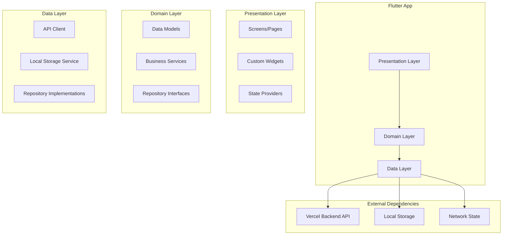
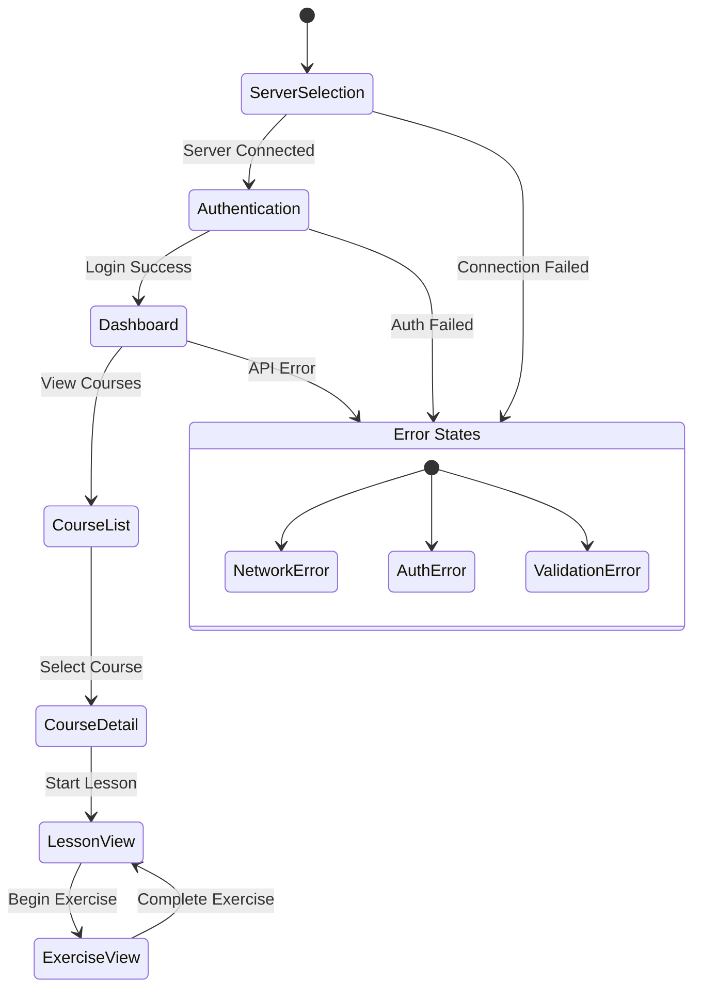

# Design Document

## Overview

WayrApp Flutter Mobile Migration transforms the existing React Native mobile application into a Flutter-based implementation while maintaining full compatibility with the existing WayrApp backend API and monorepo structure. The Flutter app will provide the same language learning functionality with improved package stability and cross-platform consistency.

The design follows Flutter best practices with a clean architecture approach, utilizing Provider for state management, Dio for HTTP communication, and Flutter Secure Storage for secure data persistence. The app will be built incrementally, starting with server selection and authentication, then expanding to include all learning features.

Key architectural decisions:
1. **Clean Architecture**: Separation of presentation, domain, and data layers
2. **Provider Pattern**: State management using Provider for reactive UI updates
3. **Repository Pattern**: Abstraction layer for data access and API communication
4. **Incremental Development**: Build and test features step by step for immediate feedback

## Architecture

### High-Level Architecture



### Project Structure

The Flutter app will be organized following clean architecture principles:

```
frontend-mobile/
├── lib/
│   ├── main.dart                    # App entry point
│   ├── app.dart                     # App configuration and routing
│   ├── core/                       # Core utilities and constants
│   │   ├── constants/              # App constants and configuration
│   │   ├── errors/                 # Error handling and exceptions
│   │   ├── network/                # Network utilities and interceptors
│   │   ├── storage/                # Storage utilities and encryption
│   │   └── utils/                  # Helper functions and utilities
│   ├── features/                   # Feature-based organization
│   │   ├── server_selection/       # Server selection feature
│   │   │   ├── data/               # Data layer (repositories, data sources)
│   │   │   ├── domain/             # Domain layer (models, services)
│   │   │   └── presentation/       # Presentation layer (screens, widgets, providers)
│   │   ├── authentication/         # Authentication feature
│   │   │   ├── data/
│   │   │   ├── domain/
│   │   │   └── presentation/
│   │   ├── courses/                # Course management feature
│   │   └── exercises/              # Exercise functionality
│   └── shared/                     # Shared components and utilities
│       ├── widgets/                # Reusable UI components
│       ├── providers/              # Global state providers
│       └── services/               # Shared services
├── test/                           # Test files
├── android/                        # Android-specific configuration
├── ios/                           # iOS-specific configuration
├── pubspec.yaml                   # Flutter dependencies and configuration
└── analysis_options.yaml         # Dart analysis configuration
```

### State Management Architecture

Using Provider pattern for predictable state management:



## Components and Interfaces

### Core Flutter Dependencies

Based on the requirements and existing React Native functionality, the Flutter app will use these key packages:

```yaml
dependencies:
  flutter:
    sdk: flutter
  
  # State Management
  provider: ^6.1.2
  
  # HTTP Client
  dio: ^5.4.3+1
  dio_certificate_pinning: ^4.1.0
  
  # Secure Storage
  flutter_secure_storage: ^9.2.2
  shared_preferences: ^2.2.3
  
  # UI Components
  material_symbols_icons: ^4.2785.1
  flutter_svg: ^2.0.10+1
  
  # Navigation
  go_router: ^14.2.7
  
  # Forms and Validation
  flutter_form_builder: ^9.3.0
  form_builder_validators: ^10.0.1
  
  # Network State
  connectivity_plus: ^6.0.5
  
  # Audio/Media (for exercises)
  just_audio: ^0.9.40
  
  # Internationalization
  flutter_localizations:
    sdk: flutter
  intl: ^0.19.0
  
  # Development
  json_annotation: ^4.9.0

dev_dependencies:
  flutter_test:
    sdk: flutter
  
  # Code Generation
  build_runner: ^2.4.12
  json_serializable: ^6.8.0
  
  # Testing
  mockito: ^5.4.4
  
  # Linting
  flutter_lints: ^4.0.0
```

### Data Models

Flutter data models will mirror the existing backend API structure with JSON serialization:

```dart
// Core Course Models
@JsonSerializable()
class Course {
  final String id;
  final String sourceLanguage;
  final String targetLanguage;
  final String name;
  final String? description;
  final bool isPublic;
  final DateTime createdAt;
  final DateTime updatedAt;
  final int? levelsCount;

  Course({
    required this.id,
    required this.sourceLanguage,
    required this.targetLanguage,
    required this.name,
    this.description,
    required this.isPublic,
    required this.createdAt,
    required this.updatedAt,
    this.levelsCount,
  });

  factory Course.fromJson(Map<String, dynamic> json) => _$CourseFromJson(json);
  Map<String, dynamic> toJson() => _$CourseToJson(this);
}

// Exercise Models
@JsonSerializable()
class Exercise {
  final String id;
  final ExerciseType exerciseType;
  final Map<String, dynamic> data;
  final DateTime createdAt;
  final DateTime updatedAt;

  Exercise({
    required this.id,
    required this.exerciseType,
    required this.data,
    required this.createdAt,
    required this.updatedAt,
  });

  factory Exercise.fromJson(Map<String, dynamic> json) => _$ExerciseFromJson(json);
  Map<String, dynamic> toJson() => _$ExerciseToJson(this);
}

enum ExerciseType {
  translation,
  translationWordBank,
  fillInTheBlank,
  verifyOrFalse,
  pairs,
  informative,
  ordering,
}

// Authentication Models
@JsonSerializable()
class AuthResponse {
  final String token;
  final String refreshToken;
  final User user;

  AuthResponse({
    required this.token,
    required this.refreshToken,
    required this.user,
  });

  factory AuthResponse.fromJson(Map<String, dynamic> json) => _$AuthResponseFromJson(json);
  Map<String, dynamic> toJson() => _$AuthResponseToJson(this);
}

@JsonSerializable()
class User {
  final String id;
  final String email;
  final String? name;
  final UserRole role;
  final DateTime createdAt;

  User({
    required this.id,
    required this.email,
    this.name,
    required this.role,
    required this.createdAt,
  });

  factory User.fromJson(Map<String, dynamic> json) => _$UserFromJson(json);
  Map<String, dynamic> toJson() => _$UserToJson(this);
}

enum UserRole { student, creator, admin }
```

### Repository Pattern Implementation

```dart
// Abstract Repository Interface
abstract class AuthRepository {
  Future<AuthResponse> login(String email, String password);
  Future<AuthResponse> register(String email, String password, String? name);
  Future<void> logout();
  Future<AuthResponse?> refreshToken();
  Future<User?> getCurrentUser();
}

// Concrete Repository Implementation
class AuthRepositoryImpl implements AuthRepository {
  final ApiClient _apiClient;
  final SecureStorageService _secureStorage;

  AuthRepositoryImpl({
    required ApiClient apiClient,
    required SecureStorageService secureStorage,
  }) : _apiClient = apiClient, _secureStorage = secureStorage;

  @override
  Future<AuthResponse> login(String email, String password) async {
    try {
      final response = await _apiClient.post('/api/v1/auth/login', data: {
        'email': email,
        'password': password,
      });
      
      final authResponse = AuthResponse.fromJson(response.data);
      await _secureStorage.storeTokens(
        authResponse.token,
        authResponse.refreshToken,
      );
      
      return authResponse;
    } catch (e) {
      throw AuthException('Login failed: ${e.toString()}');
    }
  }

  // ... other methods
}
```

### Provider State Management

```dart
// Authentication Provider
class AuthProvider extends ChangeNotifier {
  final AuthRepository _authRepository;
  
  User? _currentUser;
  bool _isAuthenticated = false;
  bool _isLoading = false;
  String? _error;

  AuthProvider({required AuthRepository authRepository})
      : _authRepository = authRepository;

  // Getters
  User? get currentUser => _currentUser;
  bool get isAuthenticated => _isAuthenticated;
  bool get isLoading => _isLoading;
  String? get error => _error;

  // Authentication Methods
  Future<void> login(String email, String password) async {
    _setLoading(true);
    _clearError();

    try {
      final authResponse = await _authRepository.login(email, password);
      _currentUser = authResponse.user;
      _isAuthenticated = true;
    } catch (e) {
      _setError(e.toString());
    } finally {
      _setLoading(false);
    }
  }

  Future<void> logout() async {
    await _authRepository.logout();
    _currentUser = null;
    _isAuthenticated = false;
    notifyListeners();
  }

  void _setLoading(bool loading) {
    _isLoading = loading;
    notifyListeners();
  }

  void _setError(String error) {
    _error = error;
    notifyListeners();
  }

  void _clearError() {
    _error = null;
    notifyListeners();
  }
}

// Server Configuration Provider
class ServerConfigProvider extends ChangeNotifier {
  String? _serverUrl;
  bool _isConnected = false;
  bool _isLoading = false;
  String? _error;

  String? get serverUrl => _serverUrl;
  bool get isConnected => _isConnected;
  bool get isLoading => _isLoading;
  String? get error => _error;

  Future<void> setServer(String url) async {
    _setLoading(true);
    _clearError();

    try {
      // Test connection to server
      final apiClient = ApiClient(baseUrl: url);
      await apiClient.get('/api/v1/health');
      
      _serverUrl = url;
      _isConnected = true;
      
      // Store server configuration
      final prefs = await SharedPreferences.getInstance();
      await prefs.setString('server_url', url);
    } catch (e) {
      _setError('Failed to connect to server: ${e.toString()}');
    } finally {
      _setLoading(false);
    }
  }

  // ... helper methods
}
```

## Data Models

### API Client Configuration

```dart
class ApiClient {
  late final Dio _dio;
  final String baseUrl;

  ApiClient({required this.baseUrl}) {
    _dio = Dio(BaseOptions(
      baseUrl: baseUrl,
      connectTimeout: const Duration(seconds: 30),
      receiveTimeout: const Duration(seconds: 30),
      headers: {
        'Content-Type': 'application/json',
        'Accept': 'application/json',
      },
    ));

    _setupInterceptors();
  }

  void _setupInterceptors() {
    // Request Interceptor - Add auth token
    _dio.interceptors.add(InterceptorsWrapper(
      onRequest: (options, handler) async {
        final token = await SecureStorageService.getToken();
        if (token != null) {
          options.headers['Authorization'] = 'Bearer $token';
        }
        handler.next(options);
      },
      onError: (error, handler) async {
        if (error.response?.statusCode == 401) {
          // Handle token refresh
          final refreshed = await _refreshToken();
          if (refreshed) {
            // Retry original request
            final clonedRequest = await _dio.request(
              error.requestOptions.path,
              options: Options(
                method: error.requestOptions.method,
                headers: error.requestOptions.headers,
              ),
              data: error.requestOptions.data,
              queryParameters: error.requestOptions.queryParameters,
            );
            handler.resolve(clonedRequest);
            return;
          }
        }
        handler.next(error);
      },
    ));

    // Logging Interceptor (development only)
    if (kDebugMode) {
      _dio.interceptors.add(LogInterceptor(
        requestBody: true,
        responseBody: true,
        logPrint: (object) => debugPrint(object.toString()),
      ));
    }
  }

  Future<Response> get(String path, {Map<String, dynamic>? queryParameters}) {
    return _dio.get(path, queryParameters: queryParameters);
  }

  Future<Response> post(String path, {dynamic data}) {
    return _dio.post(path, data: data);
  }

  // ... other HTTP methods
}
```

### Secure Storage Service

```dart
class SecureStorageService {
  static const _storage = FlutterSecureStorage(
    aOptions: AndroidOptions(
      encryptedSharedPreferences: true,
    ),
    iOptions: IOSOptions(
      accessibility: KeychainItemAccessibility.first_unlock_this_device,
    ),
  );

  static const String _tokenKey = 'auth_token';
  static const String _refreshTokenKey = 'refresh_token';
  static const String _userKey = 'current_user';

  static Future<void> storeTokens(String token, String refreshToken) async {
    await Future.wait([
      _storage.write(key: _tokenKey, value: token),
      _storage.write(key: _refreshTokenKey, value: refreshToken),
    ]);
  }

  static Future<String?> getToken() async {
    return await _storage.read(key: _tokenKey);
  }

  static Future<String?> getRefreshToken() async {
    return await _storage.read(key: _refreshTokenKey);
  }

  static Future<void> storeUser(User user) async {
    await _storage.write(key: _userKey, value: jsonEncode(user.toJson()));
  }

  static Future<User?> getUser() async {
    final userJson = await _storage.read(key: _userKey);
    if (userJson != null) {
      return User.fromJson(jsonDecode(userJson));
    }
    return null;
  }

  static Future<void> clearAll() async {
    await _storage.deleteAll();
  }
}
```

## Error Handling

### Error Classification and Handling

```dart
// Custom Exception Classes
abstract class AppException implements Exception {
  final String message;
  final String? code;
  
  AppException(this.message, {this.code});
  
  @override
  String toString() => message;
}

class NetworkException extends AppException {
  NetworkException(String message, {String? code}) : super(message, code: code);
}

class AuthException extends AppException {
  AuthException(String message, {String? code}) : super(message, code: code);
}

class ValidationException extends AppException {
  final Map<String, List<String>> errors;
  
  ValidationException(String message, this.errors, {String? code}) 
      : super(message, code: code);
}

class ServerException extends AppException {
  final int? statusCode;
  
  ServerException(String message, {this.statusCode, String? code}) 
      : super(message, code: code);
}

// Global Error Handler
class ErrorHandler {
  static String getErrorMessage(dynamic error) {
    if (error is AppException) {
      return error.message;
    } else if (error is DioException) {
      return _handleDioError(error);
    } else {
      return 'An unexpected error occurred';
    }
  }

  static String _handleDioError(DioException error) {
    switch (error.type) {
      case DioExceptionType.connectionTimeout:
      case DioExceptionType.sendTimeout:
      case DioExceptionType.receiveTimeout:
        return 'Connection timeout. Please check your internet connection.';
      case DioExceptionType.badResponse:
        return _handleHttpError(error.response?.statusCode);
      case DioExceptionType.cancel:
        return 'Request was cancelled';
      case DioExceptionType.unknown:
        return 'Network error. Please check your connection.';
      default:
        return 'An unexpected error occurred';
    }
  }

  static String _handleHttpError(int? statusCode) {
    switch (statusCode) {
      case 400:
        return 'Invalid request. Please check your input.';
      case 401:
        return 'Authentication failed. Please log in again.';
      case 403:
        return 'Access denied. You don\'t have permission.';
      case 404:
        return 'Resource not found.';
      case 500:
        return 'Server error. Please try again later.';
      default:
        return 'Server error (${statusCode ?? 'unknown'})';
    }
  }
}
```

### Error Display Components

```dart
// Error Display Widget
class ErrorDisplay extends StatelessWidget {
  final String message;
  final VoidCallback? onRetry;

  const ErrorDisplay({
    Key? key,
    required this.message,
    this.onRetry,
  }) : super(key: key);

  @override
  Widget build(BuildContext context) {
    return Center(
      child: Padding(
        padding: const EdgeInsets.all(16.0),
        child: Column(
          mainAxisAlignment: MainAxisAlignment.center,
          children: [
            Icon(
              Icons.error_outline,
              size: 64,
              color: Theme.of(context).colorScheme.error,
            ),
            const SizedBox(height: 16),
            Text(
              message,
              textAlign: TextAlign.center,
              style: Theme.of(context).textTheme.bodyLarge,
            ),
            if (onRetry != null) ...[
              const SizedBox(height: 16),
              ElevatedButton(
                onPressed: onRetry,
                child: const Text('Retry'),
              ),
            ],
          ],
        ),
      ),
    );
  }
}
```

## Testing Strategy

### Testing Architecture

The Flutter app will implement comprehensive testing following the testing pyramid:

```dart
// Unit Tests - Repository Testing
class MockApiClient extends Mock implements ApiClient {}

void main() {
  group('AuthRepository', () {
    late AuthRepositoryImpl repository;
    late MockApiClient mockApiClient;
    late MockSecureStorageService mockStorage;

    setUp(() {
      mockApiClient = MockApiClient();
      mockStorage = MockSecureStorageService();
      repository = AuthRepositoryImpl(
        apiClient: mockApiClient,
        secureStorage: mockStorage,
      );
    });

    test('login should return AuthResponse on success', () async {
      // Arrange
      final mockResponse = Response(
        requestOptions: RequestOptions(path: ''),
        data: {
          'token': 'test_token',
          'refreshToken': 'test_refresh_token',
          'user': {
            'id': '1',
            'email': 'test@example.com',
            'role': 'student',
            'createdAt': '2024-01-01T00:00:00Z',
          },
        },
      );
      
      when(mockApiClient.post('/api/v1/auth/login', data: anyNamed('data')))
          .thenAnswer((_) async => mockResponse);

      // Act
      final result = await repository.login('test@example.com', 'password');

      // Assert
      expect(result.token, 'test_token');
      expect(result.user.email, 'test@example.com');
      verify(mockStorage.storeTokens('test_token', 'test_refresh_token'));
    });
  });
}

// Widget Tests - Screen Testing
void main() {
  group('LoginScreen', () {
    testWidgets('should display login form', (WidgetTester tester) async {
      await tester.pumpWidget(
        MaterialApp(
          home: ChangeNotifierProvider(
            create: (_) => AuthProvider(authRepository: MockAuthRepository()),
            child: const LoginScreen(),
          ),
        ),
      );

      expect(find.byType(TextFormField), findsNWidgets(2)); // Email and password
      expect(find.text('Login'), findsOneWidget);
      expect(find.text('Register'), findsOneWidget);
    });

    testWidgets('should show error message on login failure', (WidgetTester tester) async {
      final mockAuthProvider = MockAuthProvider();
      when(mockAuthProvider.error).thenReturn('Invalid credentials');

      await tester.pumpWidget(
        MaterialApp(
          home: ChangeNotifierProvider<AuthProvider>.value(
            value: mockAuthProvider,
            child: const LoginScreen(),
          ),
        ),
      );

      expect(find.text('Invalid credentials'), findsOneWidget);
    });
  });
}

// Integration Tests - Full Flow Testing
void main() {
  group('Authentication Flow Integration', () {
    testWidgets('complete login flow', (WidgetTester tester) async {
      await tester.pumpWidget(MyApp());

      // Should start with server selection
      expect(find.text('Select Server'), findsOneWidget);

      // Enter server URL and connect
      await tester.enterText(find.byType(TextFormField), 'https://api.wayrapp.com');
      await tester.tap(find.text('Connect'));
      await tester.pumpAndSettle();

      // Should navigate to login screen
      expect(find.text('Login'), findsOneWidget);

      // Enter credentials and login
      await tester.enterText(find.byKey(const Key('email_field')), 'test@example.com');
      await tester.enterText(find.byKey(const Key('password_field')), 'password');
      await tester.tap(find.text('Login'));
      await tester.pumpAndSettle();

      // Should navigate to dashboard
      expect(find.text('Dashboard'), findsOneWidget);
    });
  });
}
```

## Performance Considerations

### Optimization Strategies

1. **Lazy Loading**: Use lazy loading for screens and heavy widgets
2. **Image Optimization**: Implement cached network images with compression
3. **Memory Management**: Proper disposal of controllers and streams
4. **Build Optimization**: Use const constructors and avoid unnecessary rebuilds

```dart
// Lazy Loading Example
class LazyLoadedScreen extends StatelessWidget {
  @override
  Widget build(BuildContext context) {
    return FutureBuilder<Widget>(
      future: _loadScreen(),
      builder: (context, snapshot) {
        if (snapshot.hasData) {
          return snapshot.data!;
        }
        return const CircularProgressIndicator();
      },
    );
  }

  Future<Widget> _loadScreen() async {
    // Load heavy resources asynchronously
    await Future.delayed(const Duration(milliseconds: 100));
    return const ActualScreen();
  }
}

// Optimized List Building
class OptimizedCourseList extends StatelessWidget {
  final List<Course> courses;

  const OptimizedCourseList({Key? key, required this.courses}) : super(key: key);

  @override
  Widget build(BuildContext context) {
    return ListView.builder(
      itemCount: courses.length,
      itemBuilder: (context, index) {
        return CourseCard(course: courses[index]);
      },
      // Performance optimizations
      cacheExtent: 1000,
      addAutomaticKeepAlives: false,
      addRepaintBoundaries: false,
    );
  }
}
```

## Security Considerations

### Security Implementation

```dart
// Certificate Pinning
class SecureApiClient extends ApiClient {
  SecureApiClient({required String baseUrl}) : super(baseUrl: baseUrl) {
    (_dio.httpClientAdapter as DefaultHttpClientAdapter).onHttpClientCreate = (client) {
      client.badCertificateCallback = (cert, host, port) {
        // Implement certificate pinning logic
        return _validateCertificate(cert, host);
      };
      return client;
    };
  }

  bool _validateCertificate(X509Certificate cert, String host) {
    // Validate against pinned certificates
    const pinnedFingerprints = [
      'SHA256:AAAAAAAAAAAAAAAAAAAAAAAAAAAAAAAAAAAAAAAAAAA=', // Your Vercel cert
    ];
    
    final certFingerprint = _getCertificateFingerprint(cert);
    return pinnedFingerprints.contains(certFingerprint);
  }
}

// Input Sanitization
class InputValidator {
  static String? validateEmail(String? value) {
    if (value == null || value.isEmpty) {
      return 'Email is required';
    }
    
    final emailRegex = RegExp(r'^[^@]+@[^@]+\.[^@]+$');
    if (!emailRegex.hasMatch(value)) {
      return 'Please enter a valid email';
    }
    
    // Sanitize input
    return value.trim().toLowerCase();
  }

  static String? validatePassword(String? value) {
    if (value == null || value.isEmpty) {
      return 'Password is required';
    }
    
    if (value.length < 8) {
      return 'Password must be at least 8 characters';
    }
    
    return null;
  }

  static String sanitizeInput(String input) {
    // Remove potentially dangerous characters
    return input
        .replaceAll(RegExp(r'[<>"\']'), '')
        .trim();
  }
}
```

## Monorepo Integration

### NPM Workspace Integration

The Flutter app will integrate with the existing monorepo structure:

```json
// Updated package.json scripts
{
  "scripts": {
    "mobile:flutter:dev": "cd frontend-mobile && flutter run",
    "mobile:flutter:build": "cd frontend-mobile && flutter build apk",
    "mobile:flutter:build:ios": "cd frontend-mobile && flutter build ios",
    "mobile:flutter:test": "cd frontend-mobile && flutter test",
    "mobile:flutter:analyze": "cd frontend-mobile && flutter analyze",
    "mobile:flutter:clean": "cd frontend-mobile && flutter clean && flutter pub get"
  }
}
```

### Development Workflow

```yaml
# frontend-mobile/pubspec.yaml
name: wayrapp_mobile
description: WayrApp Mobile - Flutter application for language learning
version: 1.0.0+1

environment:
  sdk: '>=3.0.0 <4.0.0'
  flutter: ">=3.10.0"

dependencies:
  flutter:
    sdk: flutter
  # ... other dependencies

dev_dependencies:
  flutter_test:
    sdk: flutter
  flutter_lints: ^4.0.0

flutter:
  uses-material-design: true
  assets:
    - assets/images/
    - assets/icons/
  fonts:
    - family: Lato
      fonts:
        - asset: assets/fonts/Lato-Regular.ttf
        - asset: assets/fonts/Lato-Bold.ttf
          weight: 700
```

The design provides a solid foundation for migrating from React Native to Flutter while maintaining all existing functionality and improving package stability. The incremental approach allows for testing at each step, starting with server selection and authentication before moving to more complex features.