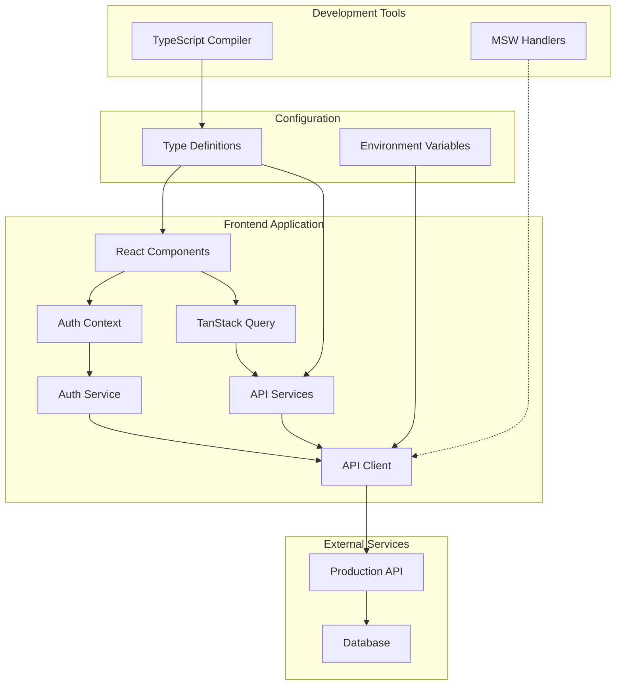

# Design Document

## Overview

This design outlines the transition of the frontend-creator application from MSW (Mock Service Worker) handlers to real API integration with the production backend at https://wayrapp.vercel.app/api/v1. The design focuses on two critical areas: aligning TypeScript interfaces with the backend Prisma schema and implementing real authentication flow.

The approach prioritizes incremental changes with minimal disruption to existing functionality while ensuring type safety and robust error handling throughout the integration process.

## Architecture

### Current State Analysis

The frontend-creator currently has:
- Well-structured service layer with axios-based API client
- Comprehensive authentication context and service
- TypeScript interfaces that are partially aligned with backend
- MSW handlers for development mocking
- Environment-based configuration support

### Target Architecture



### Integration Strategy

1. **Environment-Driven Configuration**: Use environment variables to control API endpoints and MSW enablement
2. **Type-First Approach**: Update TypeScript interfaces before implementing API calls
3. **Incremental Migration**: Start with authentication, then expand to other features
4. **Backward Compatibility**: Maintain MSW support for development scenarios

## Components and Interfaces

### 1. Type System Alignment

#### Updated Type Definitions

The current `frontend-creator/src/utils/types.ts` needs updates to match the Prisma schema:

**User Interface Updates:**
```typescript
export interface User {
  id: string;
  email: string;
  username?: string;
  countryCode?: string;
  registrationDate: string;
  lastLoginDate?: string;
  profilePictureUrl?: string;
  isActive: boolean;
  role: 'student' | 'content_creator' | 'admin';
  createdAt: string;
  updatedAt: string;
}
```

**Course Interface Updates:**
```typescript
export interface Course {
  id: string;
  sourceLanguage: string;  // Changed from source_language
  targetLanguage: string;  // Changed from target_language
  name: string;
  description?: string;
  isPublic: boolean;       // Changed from is_public, replaces status field
  createdAt: string;
  updatedAt: string;
}
```

**Exercise Interface Updates:**
```typescript
export type ExerciseType = 
  | 'translation'
  | 'fill-in-the-blank'    // Updated from fill_in_the_blank
  | 'vof'                  // New type
  | 'pairs'                // New type
  | 'informative'          // New type
  | 'ordering';            // New type

export interface Exercise {
  id: string;
  exerciseType: ExerciseType;  // Changed from exercise_type
  data: Record<string, any>;   // JSONB data from backend
  createdAt: string;
  updatedAt: string;
}
```

**New Interface Additions:**
```typescript
export interface Level {
  id: string;
  courseId: string;
  code: string;
  name: string;
  order: number;
  createdAt: string;
  updatedAt: string;
}

export interface Section {
  id: string;
  levelId: string;
  name: string;
  order: number;
  createdAt: string;
  updatedAt: string;
}

export interface Module {
  id: string;
  sectionId: string;
  moduleType: 'informative' | 'basic_lesson' | 'reading' | 'dialogue' | 'exam';
  name: string;
  order: number;
  createdAt: string;
  updatedAt: string;
}
```

### 2. Environment Configuration System

#### Environment Variables Structure

```typescript
// Environment configuration interface
interface EnvironmentConfig {
  apiUrl: string;
  appName: string;
  enableMsw: boolean;
  logLevel: string;
}

// Configuration loader
export const config: EnvironmentConfig = {
  apiUrl: import.meta.env.VITE_API_URL || 'https://wayrapp.vercel.app/api/v1',
  appName: import.meta.env.VITE_APP_NAME || 'WayrApp Creator Tool',
  enableMsw: import.meta.env.VITE_ENABLE_MSW === 'true',
  logLevel: import.meta.env.VITE_LOG_LEVEL || 'info'
};
```

#### Updated .env Configuration

```env
VITE_API_URL=https://wayrapp.vercel.app/api/v1
VITE_APP_NAME="WayrApp Creator Tool"
VITE_ENABLE_MSW=false
VITE_LOG_LEVEL=info
```

### 3. API Client Enhancement

#### Enhanced API Client Configuration

The existing API client needs minimal updates to support environment-based configuration:

```typescript
// Updated API client instantiation
export const apiClient = new ExtendedApiClient(config.apiUrl);
```

#### Authentication Token Management

The current token management system is well-designed but needs updates for the production API response format:

```typescript
// Updated auth response interface to match backend
export interface AuthResponse {
  accessToken: string;    // Changed from 'token'
  refreshToken: string;
  user: User;
}
```

### 4. TanStack Query Integration

#### Query Client Setup

```typescript
// Query client configuration
import { QueryClient, QueryClientProvider } from '@tanstack/react-query';

const queryClient = new QueryClient({
  defaultOptions: {
    queries: {
      staleTime: 5 * 60 * 1000, // 5 minutes
      cacheTime: 10 * 60 * 1000, // 10 minutes
      retry: (failureCount, error: any) => {
        // Don't retry on 4xx errors except 401
        if (error?.status >= 400 && error?.status < 500 && error?.status !== 401) {
          return false;
        }
        return failureCount < 3;
      },
    },
    mutations: {
      retry: false,
    },
  },
});
```

#### Query Hooks for Data Fetching

```typescript
// Example query hook for courses
export const useCoursesQuery = (params?: PaginationParams) => {
  return useQuery({
    queryKey: ['courses', params],
    queryFn: () => courseService.getCourses(params),
    enabled: true,
  });
};
```

### 5. Authentication Flow Enhancement

#### Updated Authentication Service

The authentication service needs updates to handle the production API endpoints and response format:

```typescript
class AuthService {
  async login(credentials: LoginCredentials): Promise<AuthResponse> {
    const response = await apiClient.post<AuthResponse>('/auth/login', credentials);
    this.setSession(response);
    return response;
  }

  async getCurrentUserProfile(): Promise<User> {
    return apiClient.get<User>('/auth/me');
  }

  private setSession(authResponse: AuthResponse): void {
    localStorage.setItem(STORAGE_KEYS.AUTH_TOKEN, authResponse.accessToken);
    localStorage.setItem(STORAGE_KEYS.REFRESH_TOKEN, authResponse.refreshToken);
    localStorage.setItem(STORAGE_KEYS.AUTH_USER, JSON.stringify(authResponse.user));
  }
}
```

#### Enhanced Authentication Context

```typescript
export const AuthProvider: React.FC<AuthProviderProps> = ({ children }) => {
  const [user, setUser] = useState<User | null>(null);
  const [isLoading, setIsLoading] = useState<boolean>(true);

  useEffect(() => {
    const initializeAuth = async () => {
      if (authService.isAuthenticated()) {
        try {
          // Fetch fresh user data from /auth/me endpoint
          const userData = await authService.getCurrentUserProfile();
          setUser(userData);
        } catch (error) {
          // If profile fetch fails, clear auth and redirect to login
          authService.logout();
        }
      }
      setIsLoading(false);
    };

    initializeAuth();
  }, []);
};
```

## Data Models

### Schema Alignment Strategy

The data model alignment follows these principles:

1. **Field Name Consistency**: Match exact field names from Prisma schema
2. **Type Safety**: Ensure TypeScript types match database column types
3. **Relationship Handling**: Properly type nested relationships
4. **Enum Alignment**: Match enum values exactly with backend definitions

### Key Model Changes

| Frontend (Current) | Backend (Prisma) | Action Required |
|-------------------|------------------|-----------------|
| `status: 'draft' \| 'published'` | `isPublic: boolean` | Replace status with isPublic |
| `exercise_type: 'multiple_choice'` | `exerciseType: 'vof'` | Update enum values |
| `source_language` | `sourceLanguage` | Update field naming |
| Missing Level/Section/Module | Full schema defined | Add missing interfaces |

### Data Transformation Layer

For cases where frontend and backend data structures differ, implement transformation utilities:

```typescript
// Data transformation utilities
export const transformers = {
  courseFromApi: (apiCourse: any): Course => ({
    id: apiCourse.id,
    sourceLanguage: apiCourse.source_language,
    targetLanguage: apiCourse.target_language,
    name: apiCourse.name,
    description: apiCourse.description,
    isPublic: apiCourse.is_public,
    createdAt: apiCourse.created_at,
    updatedAt: apiCourse.updated_at,
  }),

  courseToApi: (course: Partial<Course>): any => ({
    name: course.name,
    source_language: course.sourceLanguage,
    target_language: course.targetLanguage,
    description: course.description,
    is_public: course.isPublic,
  }),
};
```

## Error Handling

### Comprehensive Error Strategy

1. **API Error Classification**:
   - Network errors (connection issues)
   - Authentication errors (401, 403)
   - Validation errors (400)
   - Server errors (500+)

2. **Error Recovery Mechanisms**:
   - Automatic token refresh for 401 errors
   - Retry logic for transient failures
   - Graceful degradation for non-critical features

3. **User Experience**:
   - Clear error messages without technical details
   - Loading states during error recovery
   - Fallback UI for failed data loads

### Error Handling Implementation

```typescript
// Enhanced error handling in API client
class ApiClient {
  private handleError(error: AxiosError): ApiClientError {
    // Log error for debugging
    console.error('API Error:', {
      url: error.config?.url,
      method: error.config?.method,
      status: error.response?.status,
      data: error.response?.data,
    });

    // Return user-friendly error
    if (error.response?.status === 401) {
      return new ApiClientError('Your session has expired. Please log in again.', 401);
    }
    
    if (error.response?.status >= 500) {
      return new ApiClientError('Server error. Please try again later.', error.response.status);
    }

    // Default error handling
    const message = error.response?.data?.message || 'An unexpected error occurred';
    return new ApiClientError(message, error.response?.status || 0);
  }
}
```

## Testing Strategy

### Testing Approach

1. **Unit Tests**: Test individual components and services
2. **Integration Tests**: Test API integration with real endpoints
3. **E2E Tests**: Test complete user flows
4. **Type Tests**: Ensure TypeScript compilation without errors

### Test Environment Configuration

```typescript
// Test configuration for different environments
export const testConfig = {
  development: {
    apiUrl: 'http://localhost:3000/api/v1',
    enableMsw: true,
  },
  testing: {
    apiUrl: 'https://wayrapp.vercel.app/api/v1',
    enableMsw: false,
  },
  production: {
    apiUrl: 'https://wayrapp.vercel.app/api/v1',
    enableMsw: false,
  },
};
```

### Authentication Testing Strategy

```typescript
// Test authentication flow with real API
describe('Authentication Integration', () => {
  it('should login with valid credentials', async () => {
    const credentials = { email: 'test@example.com', password: 'password' };
    const response = await authService.login(credentials);
    
    expect(response.accessToken).toBeDefined();
    expect(response.user.email).toBe(credentials.email);
  });

  it('should handle invalid credentials gracefully', async () => {
    const credentials = { email: 'invalid@example.com', password: 'wrong' };
    
    await expect(authService.login(credentials)).rejects.toThrow();
  });
});
```

## Implementation Phases

### Phase 1: Foundation Setup
1. Update environment configuration
2. Install TanStack Query
3. Update TypeScript interfaces
4. Configure API client with production URL

### Phase 2: Authentication Integration
1. Update authentication service for production API
2. Implement real login flow
3. Add session persistence and validation
4. Update protected route logic

### Phase 3: Data Fetching Integration
1. Implement TanStack Query hooks
2. Update service layer for real API calls
3. Add proper loading and error states
4. Test data fetching with production API

### Phase 4: Validation and Testing
1. Comprehensive testing with real API
2. Error handling validation
3. Performance optimization
4. Documentation updates

This design provides a comprehensive roadmap for transitioning from MSW to real API integration while maintaining code quality, type safety, and user experience.