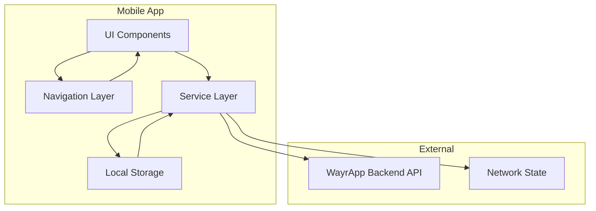
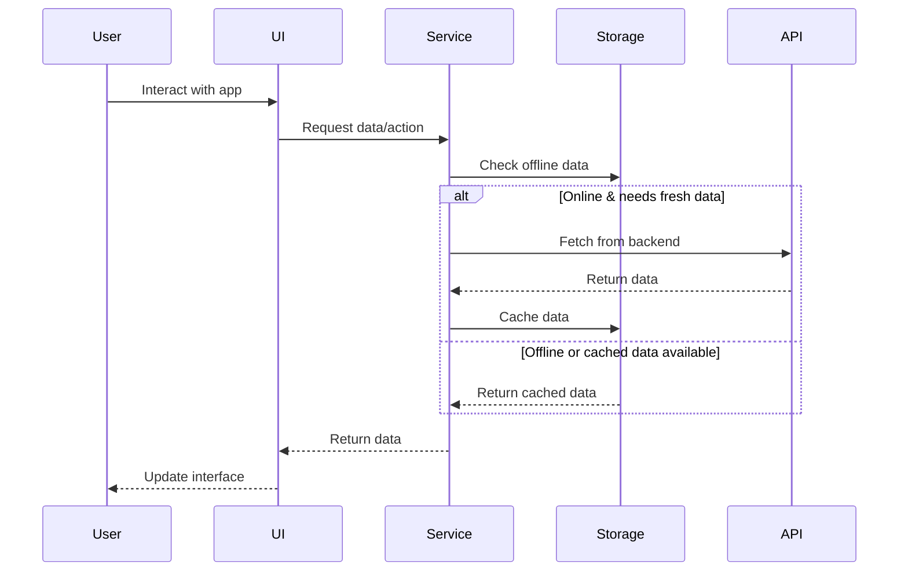

# Design Document

## Overview

WayrApp Mobile is a React Native application built with Expo that provides a comprehensive language learning experience. The app leverages the existing WayrApp backend API to deliver offline-capable, gamified language education with support for seven content types. The design follows a modular architecture with clear separation of concerns, utilizing React Native Paper for UI components and AsyncStorage for offline functionality.

The application architecture is built around three core pillars:
1. **Service Layer**: API communication, offline storage, and data synchronization
2. **Component Layer**: Reusable UI components organized by domain
3. **Navigation Layer**: Stack-based navigation with deep linking support

## Architecture

### High-Level Architecture



### Service Architecture

The service layer provides abstraction between the UI and external dependencies:

- **APIClient**: Handles HTTP communication with backend, token management, and error handling
- **OfflineService**: Manages course downloads, offline storage, and progress synchronization
- **StorageService**: Provides unified interface for AsyncStorage operations
- **AuthService**: Manages authentication state and token lifecycle

### Data Flow



## Components and Interfaces

### Core Component Structure

```
src/components/
├── auth/                    # Authentication components
│   ├── LoginForm.tsx       # Login form with validation
│   ├── RegisterForm.tsx    # Registration form
│   └── AuthGuard.tsx       # Authentication wrapper
├── learning/               # Learning-specific components
│   ├── ExerciseRenderer.tsx    # Generic exercise container
│   ├── exercises/          # Exercise type implementations
│   │   ├── TranslationExercise.tsx
│   │   ├── TranslationWordBankExercise.tsx
│   │   ├── FillInBlankExercise.tsx
│   │   ├── VerifyOrFalseExercise.tsx
│   │   ├── PairsExercise.tsx
│   │   ├── OrderingExercise.tsx
│   │   └── InformativeContent.tsx
│   ├── CourseCard.tsx      # Course display component
│   ├── LessonProgress.tsx  # Progress visualization
│   └── OfflineIndicator.tsx # Network status indicator
├── ui/                     # Reusable UI components
│   ├── LoadingSpinner.tsx  # Loading states
│   ├── ErrorBoundary.tsx   # Error handling
│   ├── Button.tsx          # Custom button component
│   └── Input.tsx           # Custom input component
└── discovery/              # Server discovery components
    ├── ServerCard.tsx      # Server selection card
    └── ServerForm.tsx      # Manual server entry
```

### Exercise Component Interface

All exercise components implement a common interface for consistency:

```typescript
interface ExerciseProps {
  exercise: Exercise;
  onAnswer: (answer: any) => void;
  onComplete: () => void;
  isOffline?: boolean;
}

interface ExerciseState {
  userAnswer: any;
  isCorrect: boolean | null;
  showFeedback: boolean;
  attempts: number;
}
```

### Service Interfaces

```typescript
interface APIClientInterface {
  login(credentials: AuthCredentials): Promise<AuthResponse>;
  register(userData: RegisterData): Promise<AuthResponse>;
  getCourses(): Promise<Course[]>;
  getCoursePackage(courseId: string): Promise<CoursePackage>;
  submitProgress(lessonId: string, answers: Answer[]): Promise<ProgressResponse>;
}

interface OfflineServiceInterface {
  isOnline(): Promise<boolean>;
  storeCoursePackage(courseId: string, coursePackage: CoursePackage): Promise<void>;
  getCoursePackage(courseId: string): Promise<CoursePackage | null>;
  storeProgressData(lessonId: string, answers: Answer[]): Promise<void>;
  syncPendingProgress(): Promise<void>;
}
```

## Data Models

### Core Data Types

Based on the existing backend API, the mobile app uses these primary data models:

```typescript
interface Course {
  id: string;
  source_language: string;
  target_language: string;
  name: string;
  description?: string;
  is_public: boolean;
  created_at: Date;
  updated_at: Date;
  levels_count?: number;
}

interface Level {
  id: string;
  course_id: string;
  code: string;
  name: string;
  order: number;
  created_at: Date;
  updated_at: Date;
  sections_count?: number;
}

interface Section {
  id: string;
  level_id: string;
  name: string;
  order: number;
  created_at: Date;
  updated_at: Date;
  modules_count?: number;
}

interface Module {
  id: string;
  section_id: string;
  module_type: "informative" | "basic_lesson" | "reading" | "dialogue" | "exam";
  name: string;
  order: number;
  created_at: Date;
  updated_at: Date;
  lessons_count?: number;
}

interface Lesson {
  id: string;
  module_id: string;
  name: string;
  description?: string | null;
  experience_points: number;
  order: number;
  created_at: Date;
  updated_at: Date;
  exercises?: LessonExercise[];
}

interface LessonExercise {
  lesson_id: string;
  exercise_id: string;
  order: number;
  exercise?: Exercise;
}

interface CoursePackage {
  course: Course;
  levels: PackagedLevel[];
  package_version: string;
}

interface PackagedLevel extends Level {
  sections: PackagedSection[];
}

interface PackagedSection extends Section {
  modules: PackagedModule[];
}

interface PackagedModule extends Module {
  lessons: PackagedLesson[];
}

interface PackagedLesson extends Lesson {
  exercises: LessonExercise[];
}

interface Exercise {
  id: string;
  exercise_type: 'translation' | 'translation-word-bank' | 'fill-in-the-blank' | 
                 'vof' | 'pairs' | 'informative' | 'ordering';
  data: ExerciseData;
  created_at: string;
  updated_at: string;
}

type ExerciseData = 
  | TranslationData 
  | TranslationWordBankData 
  | FillInBlankData 
  | VerifyOrFalseData 
  | PairsData 
  | OrderingData 
  | InformativeData;
```

### Exercise-Specific Data Models

Based on the frontend-creator forms and backend validation logic, here are the accurate exercise data structures:

```typescript
interface TranslationData {
  source_text: string;
  target_text: string;
  hints?: string[];
}

interface TranslationWordBankData {
  source_text: string;
  target_text: string;
  correct_words: string[];
  word_bank: string[];
}

interface FillInBlankData {
  text: string;
  blanks: Array<{
    position: number;
    correct_answers: string[];
    hints?: string[];
  }>;
}

interface VerifyOrFalseData {
  statement: string;
  is_true: boolean;
  explanation?: string;
}

interface PairsData {
  pairs: Array<{
    left: string;
    right: string;
  }>;
}

interface OrderingData {
  items: Array<{
    text: string;
    correct_order: number;
  }>;
}

interface InformativeData {
  title: string;
  content: string;
  media?: {
    type: 'image' | 'video' | 'audio';
    url: string;
    alt?: string;
  };
}
```

### Local Storage Schema

```typescript
interface OfflineStorage {
  courses: Record<string, {
    data: CoursePackage;
    timestamp: number;
    version: string;
  }>;
  progress: Array<{
    lessonId: string;
    answers: Answer[];
    timestamp: number;
    synced: boolean;
  }>;
  auth: {
    token: string;
    refreshToken: string;
    userId: string;
    expiresAt: number;
  };
  settings: {
    language: string;
    theme: 'light' | 'dark';
    notifications: boolean;
  };
}
```

## Error Handling

### Error Classification

The app handles four categories of errors:

1. **Network Errors**: Connection failures, timeouts, server unavailability
2. **Authentication Errors**: Invalid credentials, expired tokens, unauthorized access
3. **Validation Errors**: Invalid input data, malformed requests
4. **Application Errors**: Unexpected crashes, storage failures, parsing errors

### Error Handling Strategy

```typescript
interface ErrorHandler {
  handleNetworkError(error: NetworkError): void;
  handleAuthError(error: AuthError): void;
  handleValidationError(error: ValidationError): void;
  handleApplicationError(error: ApplicationError): void;
}

class GlobalErrorHandler implements ErrorHandler {
  handleNetworkError(error: NetworkError) {
    // Show offline indicator
    // Queue requests for retry
    // Display user-friendly message
  }
  
  handleAuthError(error: AuthError) {
    // Clear stored tokens
    // Redirect to login
    // Show authentication required message
  }
  
  // ... other error handlers
}
```

### Retry Logic

Network requests implement exponential backoff retry logic:

```typescript
interface RetryConfig {
  maxAttempts: number;
  baseDelay: number;
  maxDelay: number;
  backoffFactor: number;
}

const defaultRetryConfig: RetryConfig = {
  maxAttempts: 3,
  baseDelay: 1000,
  maxDelay: 10000,
  backoffFactor: 2
};
```

## Testing Strategy

### Testing Pyramid

The testing strategy follows a pyramid approach with different levels of testing:

1. **Unit Tests (70%)**: Individual components and services
2. **Integration Tests (20%)**: Component interactions and API integration
3. **End-to-End Tests (10%)**: Complete user workflows

### Test Categories

#### Component Testing
- Exercise component rendering and interaction
- Form validation and submission
- Navigation behavior
- Error state handling

#### Service Testing
- API client request/response handling
- Offline storage operations
- Authentication flow
- Progress synchronization

#### Integration Testing
- Authentication flow end-to-end
- Course download and offline access
- Exercise completion and progress tracking
- Network state transitions

### Testing Tools

- **Jest**: Unit and integration testing framework
- **React Native Testing Library**: Component testing utilities
- **MSW (Mock Service Worker)**: API mocking for tests
- **AsyncStorage Mock**: Local storage testing

### Test Data Management

```typescript
interface TestDataFactory {
  createCourse(overrides?: Partial<Course>): Course;
  createExercise(type: ExerciseType, overrides?: Partial<Exercise>): Exercise;
  createCoursePackage(overrides?: Partial<CoursePackage>): CoursePackage;
  createUser(overrides?: Partial<User>): User;
}
```

## Performance Considerations

### Optimization Strategies

1. **Lazy Loading**: Components and screens loaded on demand
2. **Image Optimization**: Compressed images with appropriate sizing
3. **Memory Management**: Proper cleanup of listeners and subscriptions
4. **Bundle Splitting**: Separate bundles for different app sections

### Offline Performance

- **Efficient Storage**: Compressed course packages with selective downloading
- **Background Sync**: Progress synchronization during app idle time
- **Cache Management**: LRU cache for frequently accessed content
- **Storage Limits**: Configurable storage quotas with cleanup policies

### React Native Optimizations

```typescript
// Memoization for expensive components
const ExerciseRenderer = React.memo(({ exercise, onAnswer, onComplete }) => {
  // Component implementation
});

// Virtualized lists for large datasets
import { FlatList } from 'react-native';

const CourseList = ({ courses }) => (
  <FlatList
    data={courses}
    renderItem={({ item }) => <CourseCard course={item} />}
    keyExtractor={(item) => item.id}
    removeClippedSubviews={true}
    maxToRenderPerBatch={10}
    windowSize={10}
  />
);
```

## Security Considerations

### Authentication Security

- **JWT Token Storage**: Secure storage using Keychain (iOS) and Keystore (Android)
- **Token Rotation**: Automatic refresh token rotation
- **Biometric Authentication**: Optional fingerprint/face ID for app access
- **Session Management**: Automatic logout on token expiration

### Data Protection

- **Input Sanitization**: All user inputs validated and sanitized
- **Secure Communication**: HTTPS only for API communication
- **Local Data Encryption**: Sensitive data encrypted in AsyncStorage
- **Certificate Pinning**: SSL certificate validation for API requests

### Privacy Considerations

- **Data Minimization**: Only necessary data stored locally
- **User Consent**: Clear privacy policy and data usage consent
- **Data Retention**: Configurable data retention policies
- **Offline Data**: User control over offline data storage and deletion

## Accessibility Implementation

### WCAG 2.1 Compliance

The app implements WCAG 2.1 AA standards:

- **Perceivable**: High contrast colors, scalable fonts, alt text for images
- **Operable**: Keyboard navigation, touch target sizing, gesture alternatives
- **Understandable**: Clear navigation, consistent interface, error identification
- **Robust**: Screen reader compatibility, semantic markup

### React Native Accessibility

```typescript
// Accessibility props for components
<TouchableOpacity
  accessible={true}
  accessibilityLabel="Submit answer"
  accessibilityHint="Submits your answer for this exercise"
  accessibilityRole="button"
  onPress={handleSubmit}
>
  <Text>Submit</Text>
</TouchableOpacity>

// Screen reader announcements
import { AccessibilityInfo } from 'react-native';

const announceResult = (isCorrect: boolean) => {
  const message = isCorrect ? 'Correct answer!' : 'Incorrect, try again';
  AccessibilityInfo.announceForAccessibility(message);
};
```

### Internationalization Support

- **Multi-language Support**: English, Spanish, Basque initially
- **RTL Support**: Right-to-left language compatibility
- **Cultural Adaptation**: Date formats, number formats, cultural context
- **Dynamic Language Switching**: Runtime language changes without restart